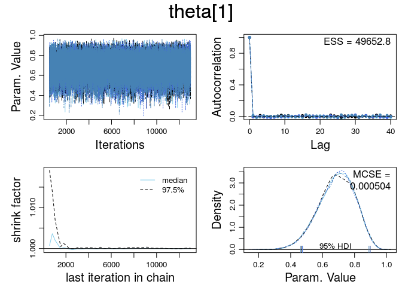

# Ex. 8.1
Andrey Ziyatdinov  
`r Sys.Date()`  


### Parameters


```r
dir <- "~/git/variani/study/01-book-Kruschke-DBDA/doc/programs/DBDA2Eprograms"
```

## Include DBDA2 files


```r
library(coda)
```

## Example `Jags-Ydich-Xnom1subj-MbernBeta-Example.R`

See code in the `Jags-Ydich-Xnom1subj-MbernBeta-Example.R` file.

### Source files


Sourced files: `Jags-Ydich-Xnom1subj-MbernBeta.R`.

### Parameters


```r
fn <- "Jags-Ydich-Xnom1subj-MbernBeta-" 

nsteps <- 10000
```

### Read data


```r
dat <- read.csv(file.path(dir, "z15N50.csv"))
str(dat)
```

```
'data.frame':	50 obs. of  1 variable:
 $ y: int  0 1 0 0 0 0 0 0 0 0 ...
```


```r
table(dat$y)
```

```

 0  1 
35 15 
```

### MCMC samples


```r
myData <- dat
out <- genMCMC(data = myData, numSavedSteps = nsteps, saveName = fn)
```


```r
summary(out)
```

```

Iterations = 501:3000
Thinning interval = 1 
Number of chains = 4 
Sample size per chain = 2500 

1. Empirical mean and standard deviation for each variable,
   plus standard error of the mean:

          Mean             SD       Naive SE Time-series SE 
     0.3076041      0.0636568      0.0006366      0.0006321 

2. Quantiles for each variable:

  2.5%    25%    50%    75%  97.5% 
0.1892 0.2633 0.3054 0.3491 0.4388 
```

### Plot diagnostics


```r
diagMCMC(out)
```

 

### Plot posteriors


```r
plotMCMC(out, data = myData)
```

 

## Example `Jags-Ydich-XnomSsubj-MbernBeta-Example.R`

See code in the `Jags-Ydich-XnomSsubj-MbernBeta-Example.R` file.

### Source files


Sourced files: `Jags-Ydich-XnomSsubj-MbernBeta.R`.

### Parameters


```r
fn <- "Jags-Ydich-XnomSsubj-MbernBeta-"

nsteps <- 50000
```

### Read data


```r
dat <- read.csv(file.path(dir, "z6N8z2N7.csv"))
str(dat)
```

```
'data.frame':	15 obs. of  2 variables:
 $ y: int  1 0 1 1 1 1 1 0 0 0 ...
 $ s: Factor w/ 2 levels "Reginald","Tony": 1 1 1 1 1 1 1 1 2 2 ...
```

### MCMC samples


```r
myData <- dat
out <- genMCMC(data = myData, numSavedSteps = nsteps, saveName = fn)
```


```r
summary(out)
```

```

Iterations = 501:13000
Thinning interval = 1 
Number of chains = 4 
Sample size per chain = 12500 

1. Empirical mean and standard deviation for each variable,
   plus standard error of the mean:

           Mean     SD  Naive SE Time-series SE
theta[1] 0.6668 0.1303 0.0005827      0.0005851
theta[2] 0.3637 0.1390 0.0006217      0.0006209

2. Quantiles for each variable:

           2.5%    25%    50%    75%  97.5%
theta[1] 0.3922 0.5803 0.6763 0.7626 0.8899
theta[2] 0.1231 0.2599 0.3553 0.4593 0.6531
```

### Plot diagnostics


```r
l_ply(varnames(out), function(p) {
  diagMCMC(out, p)
})
```

  

### Plot posteriors


```r
plotMCMC(out, data = myData, compVal = NULL , compValDiff = 0.0, ropeDiff = c(-0.05, 0.05))
```

 

## Exercise 8.1: two subjets with different sample size

### Read data


```r
dat <- read.csv(file.path(dir, "z6N8z2N7.csv"))

# remove some samples from `dat` for the Subject #2
dat <- rbind(dat[1:8, ], dat[1:8, ], dat[1:8, ], dat[1:8, ], dat[1:8, ],
  dat[9:15, ])

str(dat)
```

```
'data.frame':	47 obs. of  2 variables:
 $ y: int  1 0 1 1 1 1 1 0 1 0 ...
 $ s: Factor w/ 2 levels "Reginald","Tony": 1 1 1 1 1 1 1 1 1 1 ...
```

```r
table(dat$s)
```

```

Reginald     Tony 
      40        7 
```

### MCMC samples


```r
myData <- dat 
out <- genMCMC(data = myData, numSavedSteps = nsteps, saveName = fn)
```


```r
summary(out) 
```

```

Iterations = 501:13000
Thinning interval = 1 
Number of chains = 4 
Sample size per chain = 12500 

1. Empirical mean and standard deviation for each variable,
   plus standard error of the mean:

           Mean      SD  Naive SE Time-series SE
theta[1] 0.7277 0.06616 0.0002959      0.0002988
theta[2] 0.3641 0.13915 0.0006223      0.0006147

2. Quantiles for each variable:

           2.5%    25%    50%    75%  97.5%
theta[1] 0.5889 0.6848 0.7310 0.7746 0.8461
theta[2] 0.1225 0.2605 0.3557 0.4587 0.6524
```

### Plot diagnostics


```r
l_ply(varnames(out), function(p) {
  diagMCMC(out, p) 
})
```

  

### Plot posteriors


```r
plotMCMC(out, data = myData, compVal = NULL , compValDiff = 0.0, ropeDiff = c(-0.05, 0.05)) 
```

 

### Conclusions

More samples for the Subject #1 improves estimation of the theta 1 parameter,
as well as estimation of the difference between thetas 1 and 2.

In principle, a better estimation of theta 2 is not expected, as the number of samples remained the same in the Example.
There is also no the shrinkage effect, because the model is not hierachical.

## Exercise 8.1: three subjets with different sample size

### Read data

Use the same data set given in the Solutions.


```r
# remove some samples from `dat` for the Subject #2
dat <- data.frame(y = c( rep(1,9), rep(0,3), rep(1,45), rep(0,15), rep(1,3),rep(0,9)),
  s = c(rep("A",12), rep("B",60), rep("C",12)))

str(dat)
```

```
'data.frame':	84 obs. of  2 variables:
 $ y: num  1 1 1 1 1 1 1 1 1 0 ...
 $ s: Factor w/ 3 levels "A","B","C": 1 1 1 1 1 1 1 1 1 1 ...
```

```r
table(dat$s)
```

```

 A  B  C 
12 60 12 
```

### MCMC samples


```r
myData <- dat 
out <- genMCMC(data = myData, numSavedSteps = nsteps, saveName = fn)
```


```r
summary(out) 
```

```

Iterations = 501:13000
Thinning interval = 1 
Number of chains = 4 
Sample size per chain = 12500 

1. Empirical mean and standard deviation for each variable,
   plus standard error of the mean:

           Mean      SD  Naive SE Time-series SE
theta[1] 0.6877 0.11236 0.0005025      0.0005043
theta[2] 0.7342 0.05493 0.0002456      0.0002479
theta[3] 0.3125 0.11249 0.0005031      0.0005001

2. Quantiles for each variable:

           2.5%    25%    50%    75%  97.5%
theta[1] 0.4506 0.6135 0.6953 0.7701 0.8821
theta[2] 0.6200 0.6985 0.7367 0.7726 0.8348
theta[3] 0.1184 0.2303 0.3042 0.3863 0.5519
```

### Plot diagnostics


```r
l_ply(varnames(out), function(p) {
  diagMCMC(out, p) 
})
```

   

### Plot posteriors


```r
plotMCMC(out, data = myData, compVal = NULL , compValDiff = 0.0, ropeDiff = c(-0.05, 0.05)) 
```

 

### Conclusions

The large sample size (theta 2 vs. theta 1/3) the more narrow the HDI interval.

## Exercise 8.2


```r
smryMCMC(out, rope = c(0.4, 0.6), ropeDiff = c(-0.1, 0.1))
```

```
                         Mean      Median        Mode     ESS HDImass
theta[1]           0.68768976  0.69530934  0.69612814 50331.8    0.95
theta[2]           0.73415845  0.73669744  0.74466504 48534.8    0.95
theta[3]           0.31248350  0.30417700  0.29213665 50000.0    0.95
theta[1]-theta[2] -0.04646869 -0.04055378 -0.02099337 49399.2    0.95
theta[1]-theta[3]  0.37520626  0.38173683  0.38454366 51078.8    0.95
theta[2]-theta[3]  0.42167495  0.42876111  0.44412760 50000.0    0.95
                       HDIlow   HDIhigh CompVal PcntGtCompVal ROPElow
theta[1]           0.47166133 0.8989187     0.5        94.182     0.4
theta[2]           0.62786843 0.8419097     0.5        99.998     0.4
theta[3]           0.10591672 0.5334176     0.5         5.924     0.4
theta[1]-theta[2] -0.30091386 0.1836554     0.0        37.404    -0.1
theta[1]-theta[3]  0.06031225 0.6752928     0.0        98.644    -0.1
theta[2]-theta[3]  0.17510160 0.6564888     0.0        99.932    -0.1
                  ROPEhigh PcntLtROPE PcntInROPE PcntGtROPE
theta[1]               0.6      0.982     20.718     78.300
theta[2]               0.6      0.000      1.122     98.878
theta[3]               0.6     78.216     20.820      0.964
theta[1]-theta[2]      0.1     32.388     55.794     11.818
theta[1]-theta[3]      0.1      0.264      4.622     95.114
theta[2]-theta[3]      0.1      0.000      0.820     99.180
```

```
                         Mean      Median        Mode     ESS HDImass
theta[1]           0.68768976  0.69530934  0.69612814 50331.8    0.95
theta[2]           0.73415845  0.73669744  0.74466504 48534.8    0.95
theta[3]           0.31248350  0.30417700  0.29213665 50000.0    0.95
theta[1]-theta[2] -0.04646869 -0.04055378 -0.02099337 49399.2    0.95
theta[1]-theta[3]  0.37520626  0.38173683  0.38454366 51078.8    0.95
theta[2]-theta[3]  0.42167495  0.42876111  0.44412760 50000.0    0.95
                       HDIlow   HDIhigh CompVal PcntGtCompVal ROPElow
theta[1]           0.47166133 0.8989187     0.5        94.182     0.4
theta[2]           0.62786843 0.8419097     0.5        99.998     0.4
theta[3]           0.10591672 0.5334176     0.5         5.924     0.4
theta[1]-theta[2] -0.30091386 0.1836554     0.0        37.404    -0.1
theta[1]-theta[3]  0.06031225 0.6752928     0.0        98.644    -0.1
theta[2]-theta[3]  0.17510160 0.6564888     0.0        99.932    -0.1
                  ROPEhigh PcntLtROPE PcntInROPE PcntGtROPE
theta[1]               0.6      0.982     20.718     78.300
theta[2]               0.6      0.000      1.122     98.878
theta[3]               0.6     78.216     20.820      0.964
theta[1]-theta[2]      0.1     32.388     55.794     11.818
theta[1]-theta[3]      0.1      0.264      4.622     95.114
theta[2]-theta[3]      0.1      0.000      0.820     99.180
```

### Conclusions

The summary output provides numbers to quantify what is plotted by the plot functions.

## Exercise 8.4

### genMCMC1

Changes in the code of `genMCMC`:

```
genMCMC1 <- function(...)
{
# ...
 dataList = list(
    #y = y ,
    s = s ,
    Ntotal = Ntotal ,
    Nsubj = Nsubj
  )
# ...  
}
```


```r
dat <- read.csv(file.path(dir, "z6N8z2N7.csv"))
myData <- dat
out <- genMCMC1(data = myData)
```


```r
plotMCMC(out, data = myData)
```

 

### genMCMC2

Changes in the code of `genMCMC`:

```
genMCMC2 <- function(...)
{
# ...
 dataList = list(
    #y = y ,
    s = s ,
    Ntotal = Ntotal ,
    Nsubj = Nsubj
  )
# ...  

  modelString = "
  model {
    for ( i in 1:Ntotal ) {
      y[i] ~ dbern( theta[s[i]] )
    }
    for ( sIdx in 1:Nsubj ) {
      theta[sIdx] ~ dbeta( 1 , 1 ) # N.B.: 2,2 prior; change as appropriate.
    }
  }
  "
}
```


```r
dat <- read.csv(file.path(dir, "z6N8z2N7.csv"))
myData <- dat
out <- genMCMC2(data = myData)
```


```r
plotMCMC(out, data = myData)
```

 

### genMCMC3

Changes in the code of `genMCMC`:

```
genMCMC3 <- function(...)
{
# ...
 dataList = list(
    #y = y ,
    s = s ,
    Ntotal = Ntotal ,
    Nsubj = Nsubj
  )
# ...  

  modelString = "
  model {
    for ( i in 1:Ntotal ) {
      y[i] ~ dbern( theta[s[i]] )
    }
    for ( sIdx in 1:Nsubj ) {
      theta[sIdx] ~ dbeta( 0.5 , 0.5 ) # N.B.: 2,2 prior; change as appropriate.
    }
  }
  "
}
```


```r
dat <- read.csv(file.path(dir, "z6N8z2N7.csv"))
myData <- dat
out <- genMCMC3(data = myData)
```


```r
plotMCMC(out, data = myData)
```

 

### Conlusion

Priors on individual parameters has little to deal with the prior on the difference of parameters.
