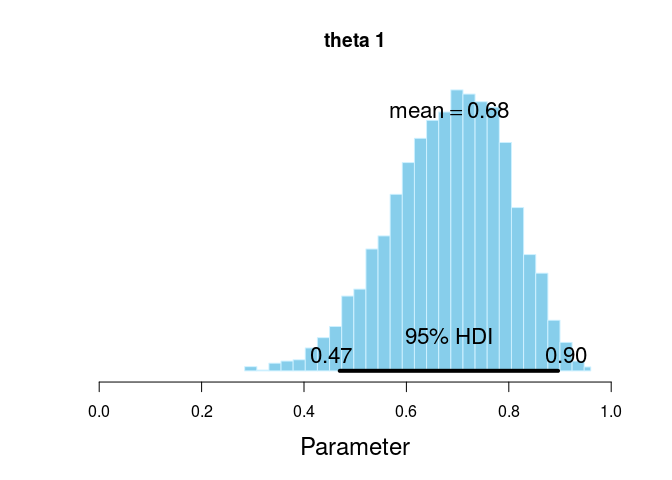
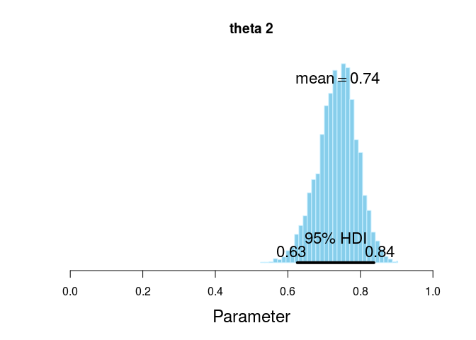
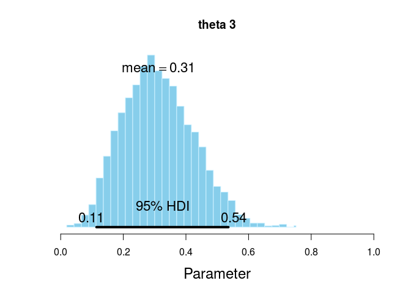

# Model, Bernoulli distribution
Andrey Ziyatdinov  
`r Sys.Date()`  


### Parameters


```r
nsteps <- 5000
```

## Include


```r
library(rjags)
library(coda)

library(BayesianFirstAid)
```

## Data


```r
dat <- data.frame(y = c( rep(1,9), rep(0,3), rep(1,45), rep(0,15), rep(1,3),rep(0,9)),
  s = c(rep("A",12), rep("B",60), rep("C",12)))

str(dat)
```

```
'data.frame':	84 obs. of  2 variables:
 $ y: num  1 1 1 1 1 1 1 1 1 0 ...
 $ s: Factor w/ 3 levels "A","B","C": 1 1 1 1 1 1 1 1 1 1 ...
```

```r
table(dat$s)
```

```

 A  B  C 
12 60 12 
```

## Model


```r
data <- dat

y <- data$y
s <- as.numeric(data$s)

Ntotal <- length(y)
Nsubj <- length(unique(s))

# Data list to be passed to JAGS
dataList = list(y = y, s = s, Ntotal = Ntotal, Nsubj = Nsubj)

# The model string written in the JAGS language
model <- "model {
  for(i in 1:Ntotal) {
    y[i] ~ dbern( theta[s[i]] )
  }
  
  for(sIdx in 1:Nsubj) {
    theta[sIdx] ~ dbeta(2, 2)
  }
}
"

numSavedSteps <- nsteps

parameters <- c("theta")     # The parameters to be monitored
adaptSteps <- 500            # Number of steps to adapt the samplers
burnInSteps <- 500           # Number of steps to burn-in the chains
nChains <- 4                 # nChains should be 2 or more for diagnostics 

thinSteps <- 1
nIter <- ceiling((numSavedSteps * thinSteps) / nChains)

# Create, initialize, and adapt the model:
jagsModel <- jags.model(textConnection(model), data = dataList, 
  n.chains = nChains, n.adapt = adaptSteps)
  
# Burn-in:
update(jagsModel, n.iter = burnInSteps)

# The saved MCMC chain:
samples <- coda.samples(jagsModel, variable.names = parameters, 
  n.iter = nIter, thin = thinSteps)

# resulting codaSamples object has these indices: 
#   codaSamples[[ chainIdx ]][ stepIdx , paramIdx ]
```

## Extract summaries

### Summary of coda samples


```r
summary(samples)
```

```

Iterations = 501:1750
Thinning interval = 1 
Number of chains = 4 
Sample size per chain = 1250 

1. Empirical mean and standard deviation for each variable,
   plus standard error of the mean:

           Mean      SD  Naive SE Time-series SE
theta[1] 0.6833 0.11200 0.0015839       0.001584
theta[2] 0.7369 0.05375 0.0007601       0.000757
theta[3] 0.3125 0.11225 0.0015875       0.001477

2. Quantiles for each variable:

           2.5%    25%    50%    75%  97.5%
theta[1] 0.4493 0.6092 0.6923 0.7668 0.8789
theta[2] 0.6261 0.7026 0.7394 0.7735 0.8371
theta[3] 0.1194 0.2310 0.3053 0.3889 0.5428
```

### Plot posteriors


```r
for(p in 1:3) {
  v <- as.numeric(laply(samples, function(x, par) as.vector(x[, par]), par = p))
  BayesianFirstAid:::plotPost(v, xlim = c(0, 1), main = paste("theta", p))
}  
```

   

