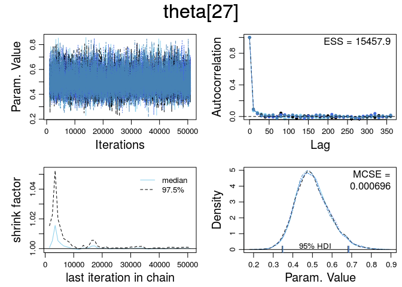
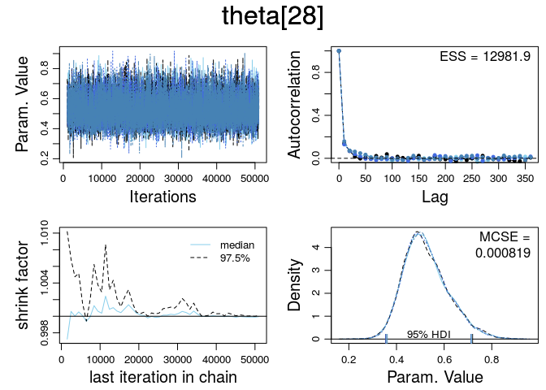
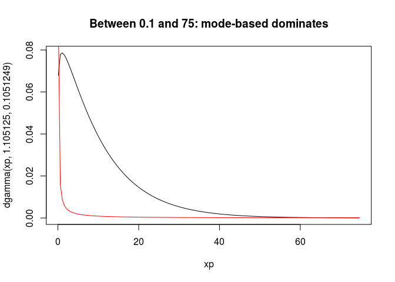

# Ex. 9.1
Andrey Ziyatdinov  
`r Sys.Date()`  


### Parameters


```r
dir <- "~/git/variani/study/01-book-Kruschke-DBDA/doc/programs/DBDA2Eprograms"
```

## Include DBDA2 files


```r
library(coda)

library(stats) # `aggregate` function
library(graphics) # `par` function
```

### Source files


Sourced files: `DBDA2E-utilities.R`.


## Example `Jags-Ydich-XnomSsubj-MbinomBetaOmegaKappa-Example.R`

See code in the `Jags-Ydich-XnomSsubj-MbinomBetaOmegaKappa-Example.R` file.

### Source files


Sourced files: `Jags-Ydich-XnomSsubj-MbinomBetaOmegaKappa.R`.

### Parameters


```r
sName <- "s"
yName <- "y"
fn <- "Jags-Ydich-XnomSsubj-MbernBetaOmegaKappa-"
 
nsteps <- 20000
```

### Data

Read data:


```r
dat <- read.csv(file.path(dir, "TherapeuticTouchData.csv"))
str(dat)
```

```
'data.frame':	280 obs. of  2 variables:
 $ y: int  1 0 0 0 0 0 0 0 0 0 ...
 $ s: Factor w/ 28 levels "S01","S02","S03",..: 1 1 1 1 1 1 1 1 1 1 ...
```

Create a data list for JAGS:


```r
y <- dat$y
s <- as.numeric(dat$s) # ensures consecutive integer levels

z <- aggregate(y, by = list(s), FUN = sum)$x
N <- aggregate(rep(1,length(y)), by = list(s), FUN = sum)$x
Nsubj <- length(unique(s))

dataList <- list(z = z, N = N, Nsubj = Nsubj)
```

Print `dataList`:


```r
dataList
```

```
$z
 [1] 1 2 3 3 3 3 3 3 3 3 4 4 4 4 4 5 5 5 5 5 5 5 6 6 7 7 7 8

$N
 [1] 10 10 10 10 10 10 10 10 10 10 10 10 10 10 10 10 10 10 10 10 10 10 10
[24] 10 10 10 10 10

$Nsubj
[1] 28
```
  
### MCMC chain  

Generate the MCMC chain:


```r
myData <- dat
out <- genMCMC(data = myData, sName = sName, yName=yName,
  numSavedSteps = nsteps, saveName = fn, thinSteps = 10)
```

### Plot diagnostics

Display diagnostics of chain, for specified parameters:


```r
pnames <- varnames(out)
for(p in pnames[c(1:2, length(pnames) - 1, length(pnames))]) { 
  diagMCMC(out, p)
}
```

    
  
### Plot posteriors
  

```r
plotMCMC(out, data = myData, sName = sName, yName = yName, 
  compVal = 0.5 , #rope=c(0.45,0.55) , # Therapeutic touch
  diffIdVec = c(1, 14, 28),              # Therapeutic touch
  compValDiff = 0.0)
```

  
  
## Exercise 9.1


```r
gammaShRaFromMeanSD(1, 10)
```

```
$shape
[1] 0.01

$rate
[1] 0.01
```

```r
gammaShRaFromModeSD(1, 10)
```

```
$shape
[1] 1.105125

$rate
[1] 0.1051249
```


```r
xp <- seq(0, 100, by = 0.5)

plot(xp, dgamma(xp, 1.105125, 0.1051249), t = 'l')
lines(xp, dgamma(xp, 0.01, 0.01), col = 'red')
```

 

```r
xp <- seq(0.1, 75, by = 0.5)

plot(xp, dgamma(xp, 1.105125, 0.1051249), t = 'l', main = "Between 0.1 and 75: mode-based dominates")
lines(xp, dgamma(xp, 0.01, 0.01), col = 'red')
```

 

```r
xp <- seq(0, 0.1, by = 0.5)

plot(xp, dgamma(xp, 1.105125, 0.1051249), t = 'l', main = "Between 0 and 0.1: mean-based dominates")
lines(xp, dgamma(xp, 0.01, 0.01), col = 'red')
```

 

```r
xp <- seq(75, 100, by = 0.5)

plot(xp, dgamma(xp, 1.105125, 0.1051249), t = 'l', main = "Between 75 and 100: mean-based dominates")
lines(xp, dgamma(xp, 0.01, 0.01), col = 'red')
```

 
  
  
  
  
  
  
  
  
  
  
  
