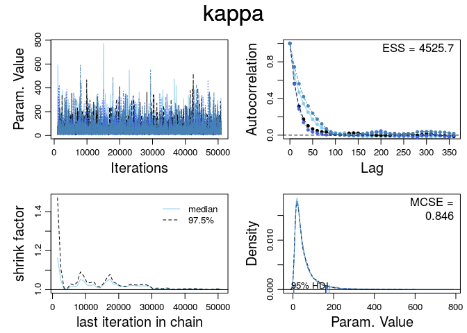
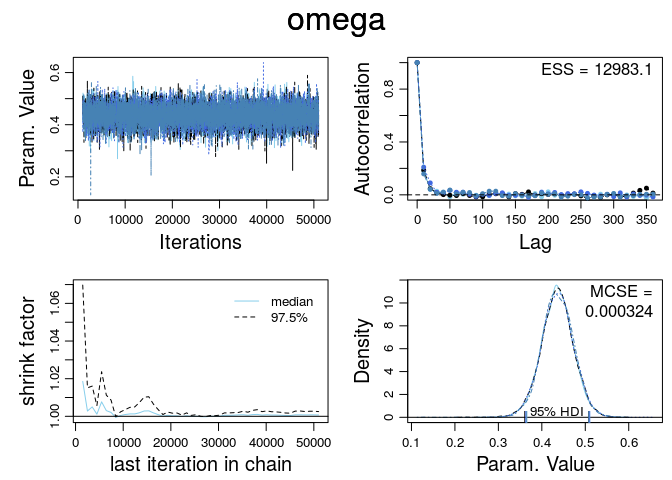

# Ex. 9.1
Andrey Ziyatdinov  
`r Sys.Date()`  


### Parameters


```r
dir <- "~/git/variani/study/01-book-Kruschke-DBDA/doc/programs/DBDA2Eprograms"
```

## Include 


```r
library(coda)

library(stats) # `aggregate` function
library(graphics) # `par` function
```

### Include `dbda`


```r
load_all("~/git/variani/dbda/")
```

```

*********************************************************************
Kruschke, J. K. (2015). Doing Bayesian Data Analysis, Second Edition:
A Tutorial with R, JAGS, and Stan. Academic Press / Elsevier.
*********************************************************************
```

## Example `Jags-Ydich-XnomSsubj-MbinomBetaOmegaKappa-Example.R`

See code in the `Jags-Ydich-XnomSsubj-MbinomBetaOmegaKappa-Example.R` file.

### Data

Read data:


```r
dat <- read.csv(file.path(dir, "TherapeuticTouchData.csv"))
str(dat)
```

```
'data.frame':	280 obs. of  2 variables:
 $ y: int  1 0 0 0 0 0 0 0 0 0 ...
 $ s: Factor w/ 28 levels "S01","S02","S03",..: 1 1 1 1 1 1 1 1 1 1 ...
```

Create a data list for JAGS:


```r
y <- dat$y
s <- as.numeric(dat$s) # ensures consecutive integer levels

z <- aggregate(y, by = list(s), FUN = sum)$x
N <- aggregate(rep(1,length(y)), by = list(s), FUN = sum)$x
Nsubj <- length(unique(s))

dataList <- list(z = z, N = N, Nsubj = Nsubj)
```

Print `dataList`:


```r
dataList
```

```
$z
 [1] 1 2 3 3 3 3 3 3 3 3 4 4 4 4 4 5 5 5 5 5 5 5 6 6 7 7 7 8

$N
 [1] 10 10 10 10 10 10 10 10 10 10 10 10 10 10 10 10 10 10 10 10 10 10 10
[24] 10 10 10 10 10

$Nsubj
[1] 28
```
  
### Model  


```r
JagsYdichXnomSsubjMbernBetaOmegaKapp <- function()
{
  out <- list()
  
  # Read The data file:
  out$myData = read.csv(system.file("data", "TherapeuticTouchData.csv", package = "dbda"))
  out$yName = "y" # column name for 0,1 values
  out$sName = "s" # column name for subject ID
  # Optional: Specify filename root and graphical format for saving output.
  # Otherwise specify as NULL or leave saveName and saveType arguments 
  # out of function calls.
  out$fileNameRoot = "Jags-Ydich-XnomSsubj-MbernBetaOmegaKappa-" 
  out$graphFileType = "eps"
  
  out$numSavedSteps = 20000
  out$thinSteps = 10
  
  oldClass(out) <- "JagsYdichXnomSsubjMbernBetaOmegaKapp"
  return(out)
}

mod1 <- JagsYdichXnomSsubjMbernBetaOmegaKapp()
```
  
### MCMC chain  

Generate the MCMC chain:


```r
out <- genMCMC(mod1, data = mod1$myData, sName = mod1$sName, yName = mod1$yName, 
  numSavedSteps = mod1$numSavedSteps, saveName = mod1$fileNameRoot, thinSteps = mod1$thinSteps)
```

### Plot diagnostics

Display diagnostics of chain, for specified parameters:


```r
pnames <- varnames(out)
for(p in pnames[c(1:2, length(pnames) - 1, length(pnames))]) { 
  diagMCMC(out, p)
}
```

    
  
### Plot posteriors
  

```r
plotMCMC(mod1, out, data = mod1$myData, sName = mod1$sName, yName = mod1$yName, 
  compVal = 0.5 , #rope=c(0.45,0.55) , # Therapeutic touch
  diffIdVec = c(1, 14, 28),              # Therapeutic touch
  compValDiff = 0.0)
```

  
  
## Exercise 9.1


```r
gammaShRaFromMeanSD(1, 10)
```

```
$shape
[1] 0.01

$rate
[1] 0.01
```

```r
gammaShRaFromModeSD(1, 10)
```

```
$shape
[1] 1.105125

$rate
[1] 0.1051249
```


```r
xp <- seq(0, 100, by = 0.5)

plot(xp, dgamma(xp, 1.105125, 0.1051249), t = 'l')
lines(xp, dgamma(xp, 0.01, 0.01), col = 'red')
```

 

```r
xp <- seq(0.1, 75, by = 0.5)

plot(xp, dgamma(xp, 1.105125, 0.1051249), t = 'l', main = "Between 0.1 and 75: mode-based dominates")
lines(xp, dgamma(xp, 0.01, 0.01), col = 'red')
```

 

```r
xp <- seq(0, 0.1, by = 0.5)

plot(xp, dgamma(xp, 1.105125, 0.1051249), t = 'l', main = "Between 0 and 0.1: mean-based dominates")
lines(xp, dgamma(xp, 0.01, 0.01), col = 'red')
```

 

```r
xp <- seq(75, 100, by = 0.5)

plot(xp, dgamma(xp, 1.105125, 0.1051249), t = 'l', main = "Between 75 and 100: mean-based dominates")
lines(xp, dgamma(xp, 0.01, 0.01), col = 'red')
```

 
  
### Update the model `mod1`

#### MCMC chain  

Generate the MCMC chain:


```r
out2 <- genMCMC(mod1, data = mod1$myData, sName = mod1$sName, yName = mod1$yName, 
  numSavedSteps = mod1$numSavedSteps, saveName = mod1$fileNameRoot, thinSteps = mod1$thinSteps,
   kappaDist = "Mode1")
```

#### Plot posteriors
  

```r
plotMCMC(mod1, out2, data = mod1$myData, sName = mod1$sName, yName = mod1$yName, 
  compVal = 0.5 , #rope=c(0.45,0.55) , # Therapeutic touch
  diffIdVec = c(1, 14, 28),              # Therapeutic touch
  compValDiff = 0.0)
```

  
                      
#### Conclusions

Exercise 9.1.D: The prior on `kappa` with `mean = 1` results in a wider range of posterior values,
because `> 75` `kappa` values are favored in this case (in comparison with `mode = 1`)

When `kappa` is large, the effect of shrinkage is greater. 

## Exercise 9.2  
  
Sample from the priors without actual data:


```r
out3 <- genMCMC(mod1, data = mod1$myData, sName = mod1$sName, yName = mod1$yName, 
  numSavedSteps = 1000, saveName = mod1$fileNameRoot, thinSteps = mod1$thinSteps,
   kappaDist = "Mean1", dataList = FALSE)
```
  

```r
out4 <- genMCMC(mod1, data = mod1$myData, sName = mod1$sName, yName = mod1$yName, 
  numSavedSteps = 1000, saveName = mod1$fileNameRoot, thinSteps = mod1$thinSteps,
   kappaDist = "Mode1", dataList = FALSE)
```


```r
plotMCMC(mod1, out3, data = mod1$myData, sName = mod1$sName, yName = mod1$yName,
  diffIdVec = c(1, 14, 28)) 
```

  
  

```r
plotMCMC(mod1, out4, data = mod1$myData, sName = mod1$sName, yName = mod1$yName,
  diffIdVec = c(1, 14, 28)) 
```

  

### Conclusions

Exercise 9.2.A: Extreme values of `theta` (around 0 or 1) are possible when `kappa` is extremely small.
When the prior is `mode = 1` there is not enough extreme values from sampling of `kappa`.
That seems to explain "rounded shoulders" in ditribution of individual `theta` (instead of uniform).

Exercise 9.2.B: The prior `mean = 1` fits better to the needs:

* uniform priors on individual `theta`'s;
* as broad a prior as possible on the difference of `theta`'s. 


## Exercise 9.3

Data simulation process is copied from [pdf](file:///home/andrey/Downloads/Kruschke-DBDA2E-ExerciseSolutions.pdf).


```r
headsTails = c( rep(1,30),rep(0,100-30),
  rep(1,40),rep(0,100-40),
  rep(1,50),rep(0,100-50),
  rep(1,60),rep(0,100-60),
  rep(1,70),rep(0,100-70) )

subjID = factor( c( rep("A",100),
  rep("B",100),
  rep("C",100),
  rep("D",100),
  rep("E",100) ) )

myData = data.frame( y=headsTails , s=subjID )
```

### MCMC samples 


```r
out5 <- genMCMC(mod1, data = myData, sName = "s", yName = "y", 
  numSavedSteps = mod1$numSavedSteps, saveName = mod1$fileNameRoot, thinSteps = mod1$thinSteps)
```

The summary output shows the effect of shinkage.


```r
summary(out5)
```

```

Iterations = 1010:51000
Thinning interval = 10 
Number of chains = 4 
Sample size per chain = 5000 

1. Empirical mean and standard deviation for each variable,
   plus standard error of the mean:

           Mean      SD  Naive SE Time-series SE
kappa    2.7113 2.97691 0.0210499      0.0974181
omega    0.5005 0.27854 0.0019696      0.0019768
theta[1] 0.3051 0.04558 0.0003223      0.0003261
theta[2] 0.4022 0.04862 0.0003438      0.0003383
theta[3] 0.5008 0.04912 0.0003473      0.0003543
theta[4] 0.5970 0.04777 0.0003378      0.0003445
theta[5] 0.6950 0.04551 0.0003218      0.0003457

2. Quantiles for each variable:

            2.5%    25%    50%    75%   97.5%
kappa    2.00000 2.0000 2.0000 2.0000 11.1770
omega    0.02646 0.2693 0.5037 0.7278  0.9719
theta[1] 0.22023 0.2734 0.3036 0.3354  0.3984
theta[2] 0.30899 0.3689 0.4013 0.4345  0.5009
theta[3] 0.40471 0.4676 0.5008 0.5342  0.5961
theta[4] 0.50255 0.5650 0.5976 0.6295  0.6898
theta[5] 0.60245 0.6649 0.6966 0.7263  0.7817
```


### MCMC samples (uniform prior)


```r
out6 <- genMCMC(mod1, data = myData, sName = "s", yName = "y", 
  numSavedSteps = mod1$numSavedSteps, saveName = mod1$fileNameRoot, thinSteps = mod1$thinSteps,
  kappaDist = "Uniform")
```


```r
summary(out6)
```

```

Iterations = 1010:51000
Thinning interval = 10 
Number of chains = 4 
Sample size per chain = 5000 

1. Empirical mean and standard deviation for each variable,
   plus standard error of the mean:

            Mean       SD  Naive SE Time-series SE
kappa    19.9957 14.95475 0.1057460      0.1135218
omega     0.5006  0.09082 0.0006422      0.0006397
theta[1]  0.3315  0.04730 0.0003345      0.0003345
theta[2]  0.4156  0.04716 0.0003335      0.0003334
theta[3]  0.5003  0.04676 0.0003306      0.0003248
theta[4]  0.5843  0.04665 0.0003299      0.0003313
theta[5]  0.6691  0.04754 0.0003362      0.0003406

2. Quantiles for each variable:

           2.5%    25%     50%     75%   97.5%
kappa    3.2819 9.5147 16.0953 25.8580 61.2084
omega    0.3144 0.4547  0.5004  0.5457  0.6872
theta[1] 0.2409 0.2990  0.3306  0.3636  0.4254
theta[2] 0.3237 0.3836  0.4154  0.4473  0.5079
theta[3] 0.4091 0.4688  0.5003  0.5318  0.5914
theta[4] 0.4926 0.5527  0.5840  0.6159  0.6752
theta[5] 0.5743 0.6374  0.6698  0.7023  0.7597
```


### Conclusions

The MLE estimates does not use the information from priors.
In the case of the Bayesian model, the priors of the top level parameters (`omega` and `kappa`) are introduced,
and the individual groups can influence the estimation of these parameters.

The effect of uniform prior on `kappa` gives a stronger shrinkage.
For example, posterior on `theta` goes from `0.22023`  to `0.3315`.

## Exercise 9.4

### Create a model


```r
JagsYdichXnomSsubjMbinomBetaOmegaKappa <- function()
{
  out <- list()
  
  # Read The data file:
  out$myData = read.csv(system.file("data", "TherapeuticTouchData.csv", package = "dbda"))
  out$yName = "y" # column name for 0,1 values
  out$sName = "s" # column name for subject ID
  # Optional: Specify filename root and graphical format for saving output.
  # Otherwise specify as NULL or leave saveName and saveType arguments 
  # out of function calls.
  out$fileNameRoot = "Jags-Ydich-XnomSsubj-MbinomBetaOmegaKappa-" 
  out$graphFileType = "eps"
  
  out$numSavedSteps = 5000
  out$thinSteps = 10
  
  oldClass(out) <- "JagsYdichXnomSsubjMbinomBetaOmegaKappa"
  return(out)
}

mod2 <- JagsYdichXnomSsubjMbinomBetaOmegaKappa()
```
  

### `runjags` & 3 chains


```r
t1 <- system.time({
  out7 <- genMCMC(mod2, data = mod2$myData, sName = mod2$sName, yName = mod2$yName, 
    numSavedSteps = mod2$numSavedSteps, saveName = mod2$fileNameRoot, thinSteps = mod2$thinSteps,
    runjagsMethod = "parallel", useRunjags = TRUE, nChains = 3)  
})
```

Time:


```r
t1
```

```
   user  system elapsed 
  0.879   0.330  20.126 
```


```r
diagMCMC(out7, "omega")
```

 


### `rjags` & 1 chain


```r
t2 <- system.time({
  out8 <- genMCMC(mod2, data = mod2$myData, sName = mod2$sName, yName = mod2$yName, 
    numSavedSteps = mod2$numSavedSteps, saveName = mod2$fileNameRoot, thinSteps = mod2$thinSteps,
    useRunjags = FALSE, nChains = 3)
})
```

Time:


```r
t2
```

```
   user  system elapsed 
 27.460   0.016  27.492 
```


```r
diagMCMC(out8, "omega")
```

 
