# Ex. 10.1
Andrey Ziyatdinov  
`r Sys.Date()`  


## Include 

### Include `dbda`


```r
load_all("~/git/variani/dbda/")
```

```

*********************************************************************
Kruschke, J. K. (2015). Doing Bayesian Data Analysis, Second Edition:
A Tutorial with R, JAGS, and Stan. Academic Press / Elsevier.
*********************************************************************
```

## Exercise 10.1

Functions:


```r
pD <- function(z, N, a, b) exp(lbeta(z + a, N - z + b) - lbeta(a, b))
```

### Part A


```r
z <- 7
N <- 10

w1 <- 0.25
w2 <- 0.75
k <- 6

a1 <- w1 * (k - 2) + 1
b1 <- (1 - w1) * (k - 2) + 1

a2 <- w2 * (k - 2) + 1
b2 <- (1 - w2) * (k - 2) + 1

(pD1 <- pD(z, N, a1, b1))
```

```
[1] 0.0004440004
```

```r
(pD2 <- pD(z, N, a2, b2))
```

```
[1] 0.001332001
```

```r
(BF <- pD1 / pD2)
```

```
[1] 0.3333333
```

```r
(p1 <- BF/(BF+1))
```

```
[1] 0.25
```

```r
(p2 <- 1 - p1)
```

```
[1] 0.75
```


```r
z <- 7
N <- 10

w1 <- 0.25
w2 <- 0.75
k <- 202

a1 <- w1 * (k - 2) + 1
b1 <- (1 - w1) * (k - 2) + 1

a2 <- w2 * (k - 2) + 1
b2 <- (1 - w2) * (k - 2) + 1

(pD1 <- pD(z, N, a1, b1))
```

```
[1] 3.322005e-05
```

```r
(pD2 <- pD(z, N, a2, b2))
```

```
[1] 0.002048602
```

```r
(BF <- pD1 / pD2)
```

```
[1] 0.01621596
```

```r
(p1 <- BF/(BF+1))
```

```
[1] 0.0159572
```

```r
(p2 <- 1 - p1)
```

```
[1] 0.9840428
```

### Conclusion (Part C)

In the latter case, the priors show more certanty on whether the two factories are biased.
Hence, a small amount of data (N = 10) favours the second model more.

## Exercise 10.2


```r
JagsYdichXnom1subjMbernBetaModelComp <- function()
{
  out <- list()
  
  oldClass(out) <- "JagsYdichXnom1subjMbernBetaModelComp"
  return(out)
}

mod <- JagsYdichXnom1subjMbernBetaModelComp()
```

### Part A

Data:


```r
N = 9
z = 6
y = c( rep(0,N-z) , rep(1,z) )

dataList = list(y = y , N = N )    
```

#### MCMC samples


```r
out <- genMCMC(mod, dataList = dataList)
```

#### Diagnostics


```r
pnames <- varnames(out)
for(p in pnames) { 
  diagMCMC(out, p)
}
```

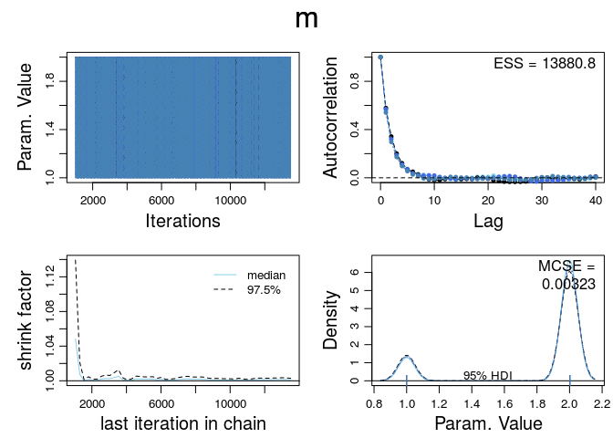 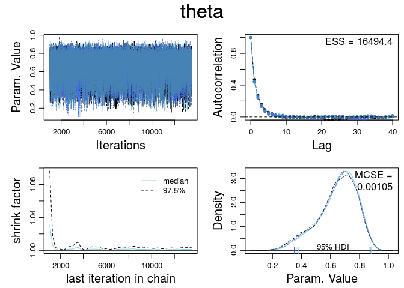 

#### Priors


```r
dataList0 <- dataList
dataList0$y <- NULL

out0 <- genMCMC(mod, dataList = dataList0)

plotMCMC(mod, out0)
```

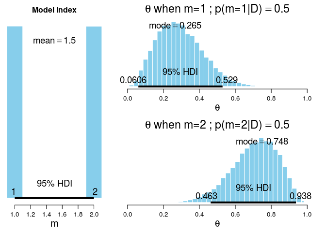 

#### Posteriors


```r
plotMCMC(mod, out)
```

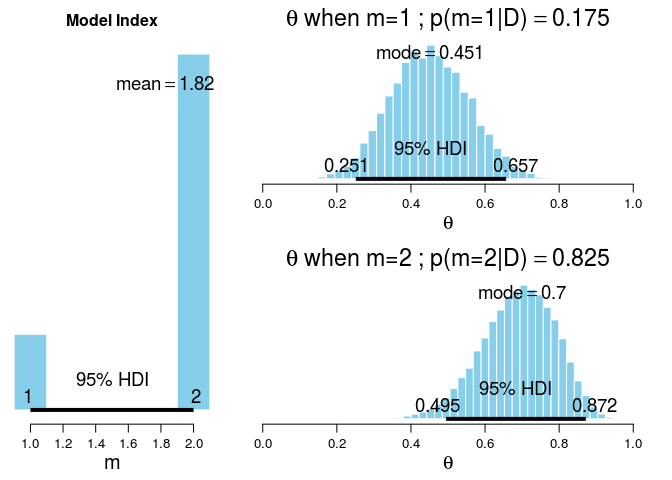 

```
        ESS      mean    median      mode hdiMass    hdiLow   hdiHigh
theta 41233 0.6900564 0.6960497 0.7002734    0.95 0.4947206 0.8719904
      compVal pGtCompVal ROPElow ROPEhigh pLtROPE pInROPE pGtROPE
theta      NA         NA      NA       NA      NA      NA      NA
```

### Part B


```r
plotPost(as.matrix(out, chains = TRUE)[, "theta"])
```

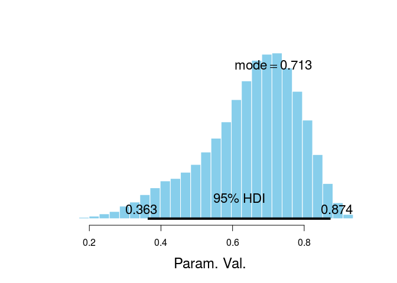 

```
                 ESS      mean    median      mode hdiMass    hdiLow
Param. Val. 16772.23 0.6505017 0.6722863 0.7132318    0.95 0.3630052
              hdiHigh compVal pGtCompVal ROPElow ROPEhigh pLtROPE pInROPE
Param. Val. 0.8737139      NA         NA      NA       NA      NA      NA
            pGtROPE
Param. Val.      NA
```

The distribution is left-skewed because of the other model with `omega = 0.25`.


### Part C


```r
N = 10
z = 7
y = c( rep(0,N-z) , rep(1,z) )

dataList = list(y = y , N = N )    
```

#### kappa 6


```r
out1 <- genMCMC(mod, dataList, kappa = 6)

plotMCMC(mod, out1)
```

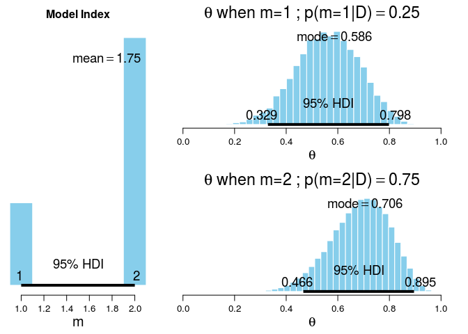 


```r
summary(out1)
```

```

Iterations = 1001:13500
Thinning interval = 1 
Number of chains = 4 
Sample size per chain = 12500 

1. Empirical mean and standard deviation for each variable,
   plus standard error of the mean:

        Mean     SD  Naive SE Time-series SE
m     1.7501 0.4329 0.0019361      0.0023343
theta 0.6554 0.1270 0.0005678      0.0006688

2. Quantiles for each variable:

        2.5%    25%    50%    75%  97.5%
m     1.0000 2.0000 2.0000 2.0000 2.0000
theta 0.3879 0.5708 0.6655 0.7494 0.8733
```

#### kappa 202


```r
out2 <- genMCMC(mod, dataList, kappa = 202)
```


```r
summary(out2)
```

```

Iterations = 1001:13500
Thinning interval = 1 
Number of chains = 4 
Sample size per chain = 12500 

1. Empirical mean and standard deviation for each variable,
   plus standard error of the mean:

        Mean      SD  Naive SE Time-series SE
m     1.0000 0.00000 0.0000000      0.0000000
theta 0.2733 0.03058 0.0001367      0.0001367

2. Quantiles for each variable:

        2.5%    25%    50%    75%  97.5%
m     1.0000 1.0000 1.0000 1.0000 1.0000
theta 0.2153 0.2523 0.2726 0.2937 0.3349
```

#### kappa 52


```r
out3 <- genMCMC(mod, dataList, thinSteps = 10, kappa = 52, mPriorProb = c(0.95, 0.05))
```


```r
plotMCMC(mod, out3) 
```

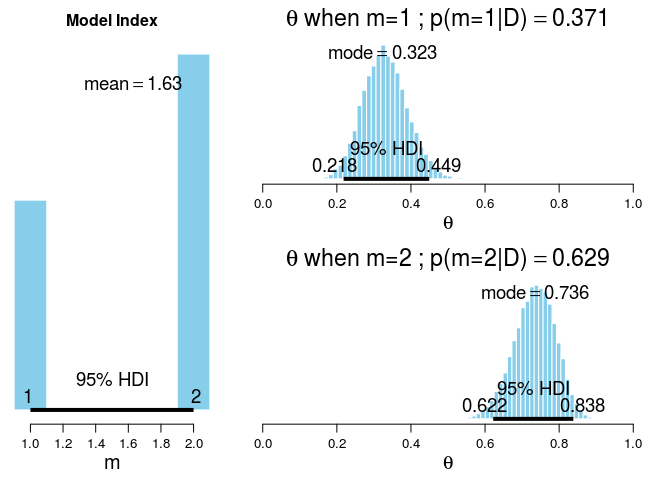 

```
        ESS      mean    median     mode hdiMass    hdiLow   hdiHigh
theta 31457 0.7338589 0.7362838 0.735508    0.95 0.6219923 0.8381579
      compVal pGtCompVal ROPElow ROPEhigh pLtROPE pInROPE pGtROPE
theta      NA         NA      NA       NA      NA      NA      NA
```


```r
pnames <- varnames(out3)
for(p in pnames) { 
  diagMCMC(out3, p) 
}
```

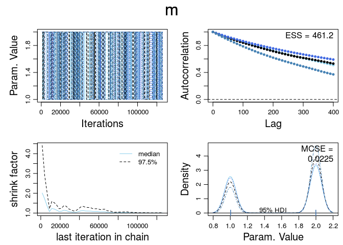 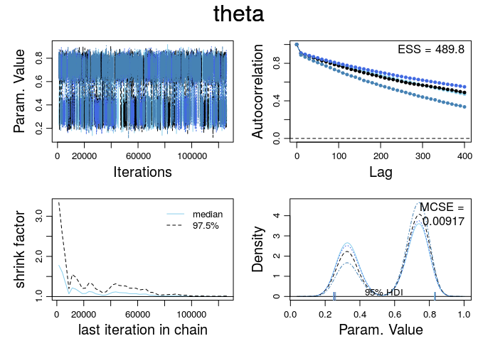 

## Exercise 10.3

### Part A

Model:

```
theta <- equals(m,1)*theta1 + equals(m,2)*theta2
theta1 ~ dbeta( omega1[m]*(kappa1[m]-2)+1 , (1-omega1[m])*(kappa1[m]-2)+1 )
omega1[1] <- .10 # true prior value
omega1[2] <- .10 # pseudo prior value
kappa1[1] <- 20 # true prior value
kappa1[2] <- 20 # pseudo prior value
theta2 ~ dbeta( omega2[m]*(kappa2[m]-2)+1 , (1-omega2[m])*(kappa2[m]-2)+1 )
omega2[1] <- .90 # pseudo prior value
omega2[2] <- .90 # true prior value
kappa2[1] <- 20 # pseudo prior value
kappa2[2] <- 20 # true prior value
```


```r
JagsYdichXnom1subjMbernBetaModelCompPseudoPrior <- function()
{
  out <- list()
  
  oldClass(out) <- "JagsYdichXnom1subjMbernBetaModelCompPseudoPrior"
  return(out)
}

mod2 <- JagsYdichXnom1subjMbernBetaModelCompPseudoPrior()
```

#### Pseudo-priors = priors


```r
out4 <- genMCMC(mod2, 
  omega1 = c(.10, # true prior value
    .10), # pseudo prior value
  kappa1 = c(20, # true prior value
    20), # pseudo prior value
  omega2 = c(.90, # pseudo prior value
    .90), # true prior value
  kappa2 = c(20, # pseudo prior value
    20), # true prior value
)
```


```r
diagMCMC(out4, "m") 
```

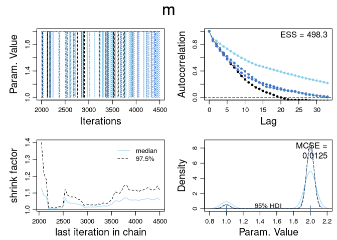 


```r
plotMCMC(mod2, out4) 
```

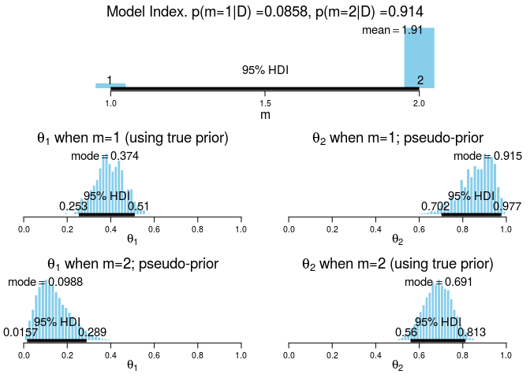 

```
              ESS      mean    median      mode hdiMass hdiLow   hdiHigh
theta[2] 5491.342 0.6832251 0.6854429 0.6914044    0.95 0.5598 0.8128747
         compVal pGtCompVal ROPElow ROPEhigh pLtROPE pInROPE pGtROPE
theta[2]      NA         NA      NA       NA      NA      NA      NA
```

#### Pseudo-priors != priors


```r
out5 <- genMCMC(mod2, 
  omega1 = c(.10, # true prior value
    .40), # pseudo prior value
  kappa1 = c(20, # true prior value
    50), # pseudo prior value
  omega2 = c(.70, # pseudo prior value
    .90), # true prior value
  kappa2 = c(50, # pseudo prior value
    20), # true prior value
)
```


```r
diagMCMC(out5, "m") 
```

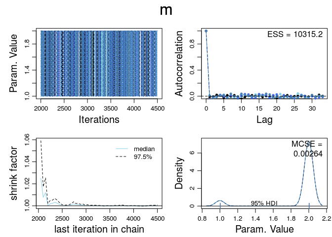 


```r
plotMCMC(mod2, out5) 
```

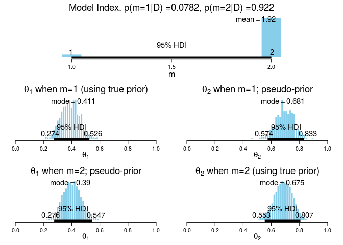 

```
              ESS     mean    median      mode hdiMass    hdiLow   hdiHigh
theta[2] 5726.088 0.684489 0.6857054 0.6753531    0.95 0.5533475 0.8065044
         compVal pGtCompVal ROPElow ROPEhigh pLtROPE pInROPE pGtROPE
theta[2]      NA         NA      NA       NA      NA      NA      NA
```

### Part B


```r
out6 <- genMCMC(mod2, 
  omega1 = c(.10, # true prior value
    .50), # pseudo prior value
  kappa1 = c(20, # true prior value
    2.1), # pseudo prior value
  omega2 = c(.50, # pseudo prior value
    .90), # true prior value
  kappa2 = c(2.1, # pseudo prior value
    20), # true prior value
)
```


```r
diagMCMC(out6, "m") 
```

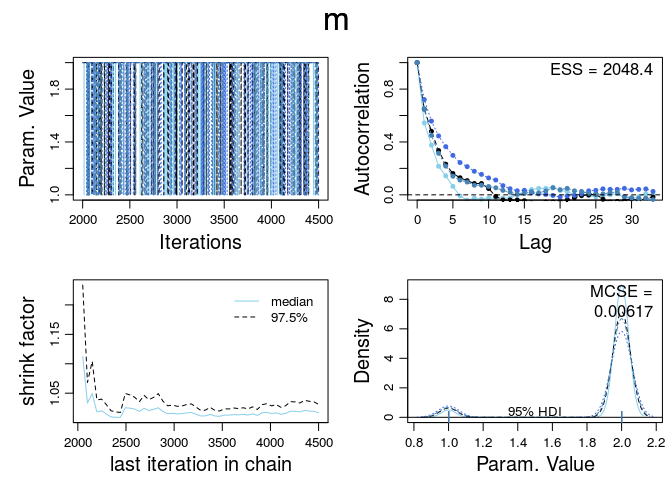 


```r
plotMCMC(mod2, out6) 
```

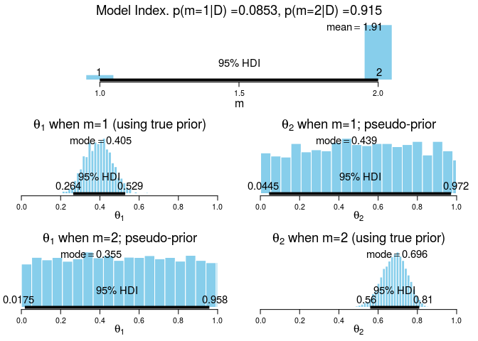 

```
              ESS      mean    median      mode hdiMass    hdiLow
theta[2] 6280.296 0.6834989 0.6859609 0.6961292    0.95 0.5597542
           hdiHigh compVal pGtCompVal ROPElow ROPEhigh pLtROPE pInROPE
theta[2] 0.8095651      NA         NA      NA       NA      NA      NA
         pGtROPE
theta[2]      NA
```

#### Conclusions

The ESS is around 2,000 with the broad pseudo-priors, which is an intermediate number between good (10,000) and bad (500) solutions.


