# Ex. 12
Andrey Ziyatdinov  
`r Sys.Date()`  


## Include 

### Include `dbda`


```r
load_all("~/git/variani/dbda/")
```

```

*********************************************************************
Kruschke, J. K. (2015). Doing Bayesian Data Analysis, Second Edition:
A Tutorial with R, JAGS, and Stan. Academic Press / Elsevier.
*********************************************************************
```

## Exercise 12.1


```r
z <- 7
N <- 24
```

### Part A


```r
theta <- 0.5

p <- theta^z * (1 - theta)^(N - z)
p
```

```
[1] 5.960464e-08
```

### Part B


```r
# spike prior on 0.5
a <- 2000
b <- 2000

BernBeta(c(a, b), c(rep(0, N-z), rep(1, z)) , 
  ROPE = c(0.48, 0.52),
  plotType = "Bars", showCentTend = "Mode", showHDI = TRUE, showpD = TRUE)
```

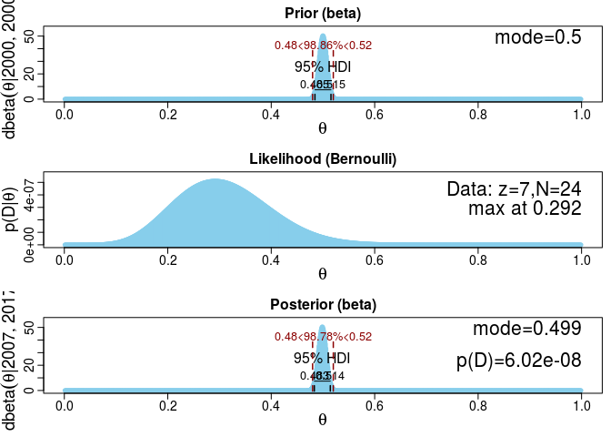 

```
[1] 2007 2017
```

The resulted p-value, as shown on the figure:


```r
pDnull <- 6.02e-8
```

### Part C
 
 

```r
# Haldane prior
a <- 0.01
b <- 0.01

BernBeta(c(a, b), c(rep(0, N-z), rep(1, z)) , 
  ROPE = c(0.48, 0.52),
  plotType = "Bars", showCentTend = "Mode", showHDI = TRUE, showpD = TRUE)
```

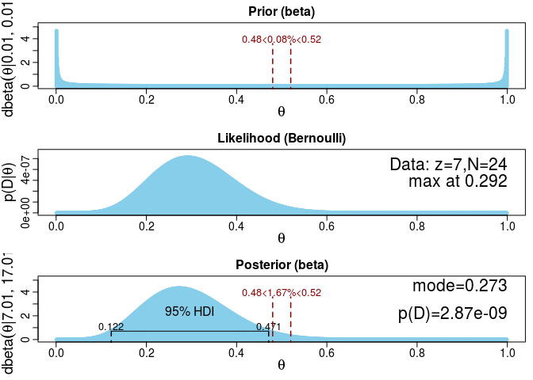 

```
[1]  7.01 17.01
```

The resulted p-value, as shown on the figure:


```r
pDHaldane <- 2.87e-9
```

The Bayes' factor:


```r
BF <- pDHaldane / pDnull
BF
```

```
[1] 0.04767442
```

### Part D

The BF using the Savage-Dickey method is the ratio of percentage of prior within the ROPE over the percentage of posterior within the ROPE.


```r
BFSD <- 0.08 / 1.67
BFSD
```

```
[1] 0.04790419
```

### Part E


```r
# midly informed prior 
a <- 2
b <- 4

BernBeta(c(a, b), c(rep(0, N-z), rep(1, z)) , 
  ROPE = c(0.48, 0.52),
  plotType = "Bars", showCentTend = "Mode", showHDI = TRUE, showpD = TRUE)
```

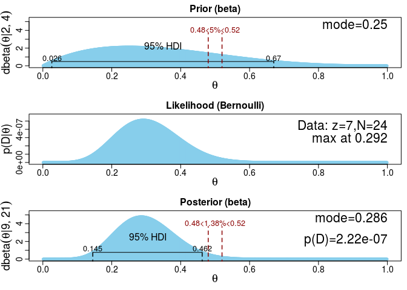 

```
[1]  9 21
```


```r
pDInformed <- 2.22e-7

BF <- pDInformed / pDnull
BF
```

```
[1] 3.687708
```

### Part F


```r
BFSD <- 5 / 1.38 
BFSD
```

```
[1] 3.623188
```

### Part G

Haldane prior: HDI for theta is from 0.122 to 0.471 (BF is 3.69).

Informed prior: HDI for theta is from 0.145 to 0.462 (BF is 0.05).


### Part H

The mild-informed prior is preferred for model comparison based on the BF.

## Exercise 12.2

### Model


```r
OneOddGroupModelComp2E <- function()
{
  out <- list()
  
  oldClass(out) <- "OneOddGroupModelComp2E"
  return(out)
}

mod <- OneOddGroupModelComp2E()
```

### Data


```r
dataList <- genMCMC(mod, returnDataList = TRUE)

str(dataList)
```

```
List of 5
 $ nCond      : int 4
 $ nSubj      : int 80
 $ CondOfSubj : num [1:80] 1 1 1 1 1 1 1 1 1 1 ...
 $ nTrlOfSubj : num [1:80] 20 20 20 20 20 20 20 20 20 20 ...
 $ nCorrOfSubj: num [1:80] 8 7 8 6 7 9 8 9 9 8 ...
```

```r
aggregate(dataList$nCorrOfSubj, by = list(dataList$CondOfSubj) , FUN = mean )
```

```
  Group.1    x
1       1  8.0
2       2 10.0
3       3 10.2
4       4 10.4
```


### MCMC chain

Generate the MCMC chain:


```r
out <- genMCMC(mod)
```

### Diagnostics

Display diagnostics of chain, for specified parameters:


```r
pnames <- c("mdlIdx","omega[1]","omega0","kappa[1]","theta[1]")
for(p in pnames) { 
  diagMCMC(out, p)
}
```

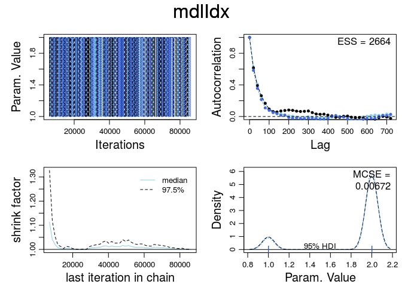 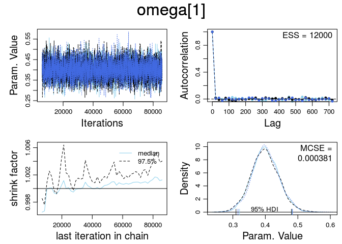  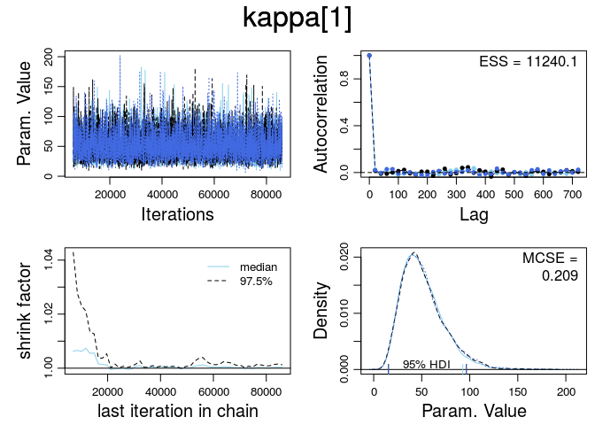 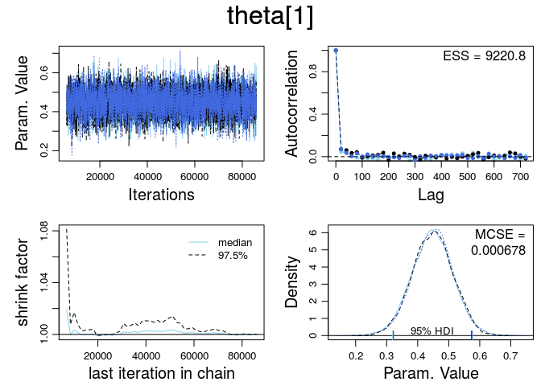 

### Plotting


```r
plotMCMC(mod, out)
```

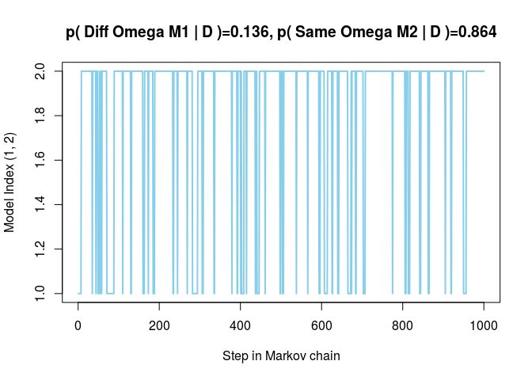 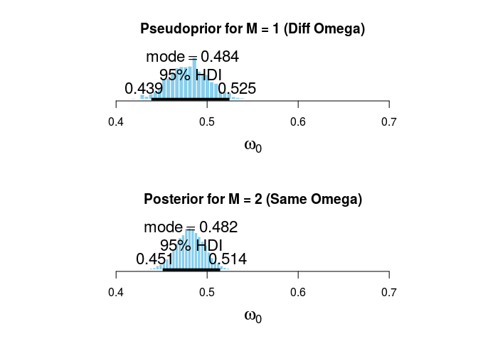 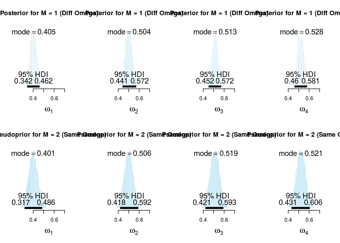 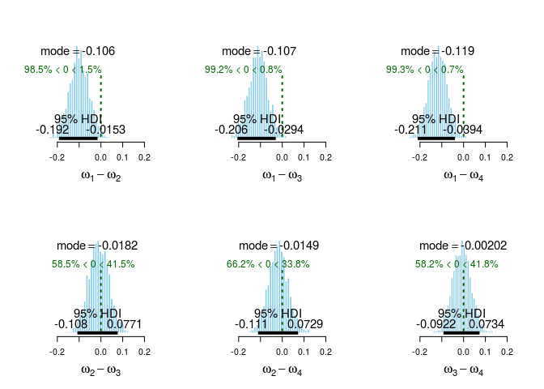 

### Part A

Model 2 (the single-mode model) is preferred with the posterior probability 0.864.

### Part B

The plots of the diferences imply that omega1 is distinct from the others.

### Model with group 1

Generate the MCMC chain:


```r
out2 <- genMCMC(mod, model = "group1") 
```


```r
plotMCMC(mod, out2) 
```

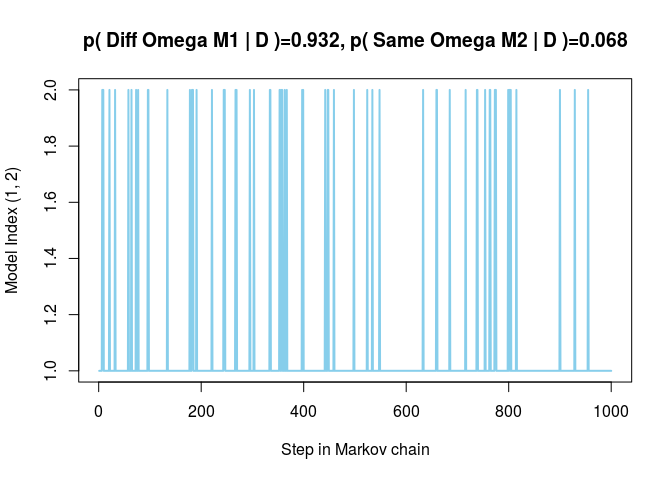 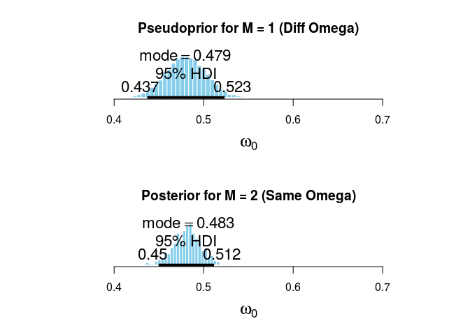 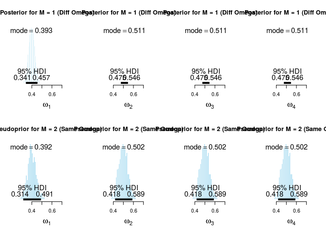 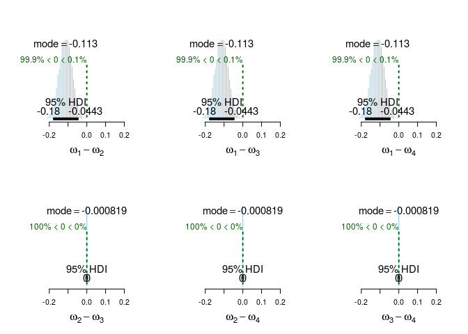 
