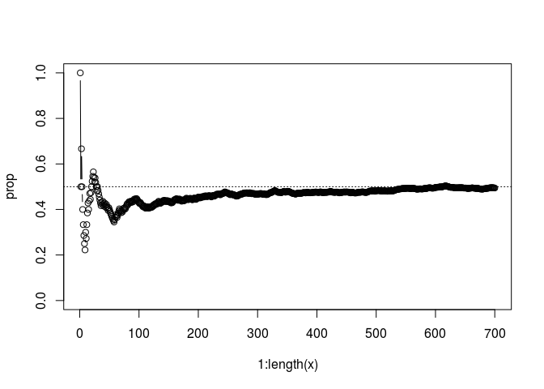
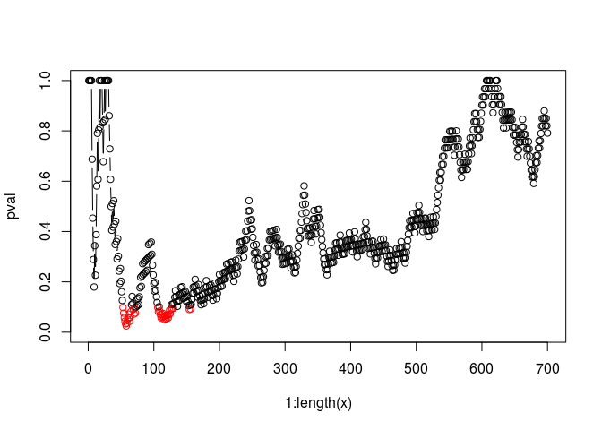
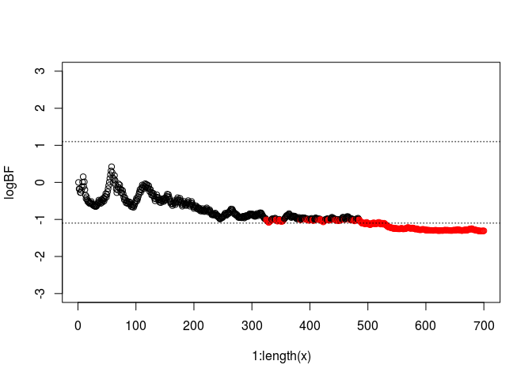
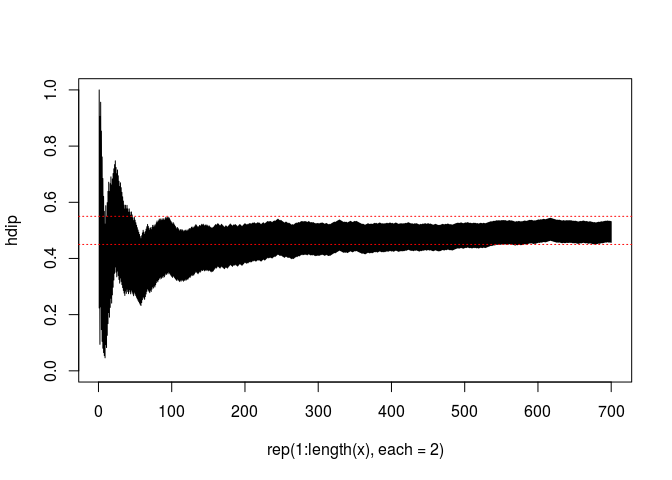
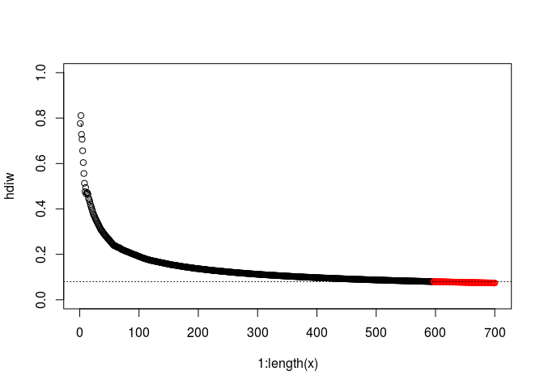

# Ex. 13
Andrey Ziyatdinov  
`r Sys.Date()`  


## Include 

### Include `dbda`


```r
load_all("~/git/variani/dbda/")
```

```

*********************************************************************
Kruschke, J. K. (2015). Doing Bayesian Data Analysis, Second Edition:
A Tutorial with R, JAGS, and Stan. Academic Press / Elsevier.
*********************************************************************
```

## Exercise 13.2

### Replicate Table 13.2

Use the `nullVal` and `ROPE` arguments, when the goal of power analysis is to exclude a null value.


```r
minNforHDIpower(genPriorMode = 0.75, genPriorN = 2000, 
  HDImaxwid = NULL, nullVal = 0.5, ROPE = c(0.48, 0.52), 
  desiredPower = 0.80, audPriorMode = 0.5, audPriorN = 2, HDImass = 0.95, initSampSize = 5, verbose = FALSE)
```

```
[1] 30
```

Use the `HDImaxwid` argument, when the goal of power analysis is precision.


```r
minNforHDIpower(genPriorMode = 0.8, genPriorN = 10, 
  HDImaxwid = 0.20, nullVal = NULL, ROPE = NULL, 
  desiredPower = 0.80, audPriorMode = 0.5, audPriorN = 2, HDImass = 0.95, initSampSize = 5, verbose = FALSE)
```

```
[1] 87
```

### Part A

When the data-generating distribution is vague, with k = 10 and w = 0.80, then 87 flios are needed for 80% chance 
of getting the 95% HDI with width to be less than 0.2.


```r
minNforHDIpower(genPriorMode = 0.8, genPriorN = 2000, 
  HDImaxwid = 0.20, nullVal = NULL, ROPE = NULL, 
  desiredPower = 0.80, audPriorMode = 0.5, audPriorN = 2, HDImass = 0.95, initSampSize = 5, verbose = FALSE)
```

```
[1] 67
```

If the data-generating distribution is certan, with k = 2000, then the analogous minimal N is 67.

### Part C


```r
minNforHDIpower(genPriorMode = 0.8, genPriorN = 2000, 
  HDImaxwid = NULL, nullVal = 0.5, ROPE = c(0.48, 0.52), 
  desiredPower = 0.80, audPriorMode = 0.5, audPriorN = 2, HDImass = 0.95, initSampSize = 5, verbose = FALSE)
```

```
[1] 19
```


```r
minNforHDIpower(genPriorMode = 0.8, genPriorN = 2, 
  HDImaxwid = NULL, nullVal = 0.5, ROPE = c(0.48, 0.52), 
  desiredPower = 0.80, audPriorMode = 0.5, audPriorN = 2, HDImass = 0.95, initSampSize = 5, verbose = FALSE)
```

```
[1] 134
```

### Part D


```r
omega <- 0.8
kappa <- 2

pbeta(1 - 0.50, shape1=(omega)*(kappa-2)+1 , shape2=(1-omega)*(kappa-2)+1 )
```

```
[1] 0.5
```

```r
pbeta(1 - 0.52, shape1=(omega)*(kappa-2)+1 , shape2=(1-omega)*(kappa-2)+1 )
```

```
[1] 0.48
```


```r
minNforHDIpower(genPriorMode = 0.8, genPriorN = 2, 
  HDImaxwid = NULL, nullVal = 0.5, ROPE = c(0, 0.52), 
  desiredPower = 0.80, audPriorMode = 0.5, audPriorN = 2, HDImass = 0.95, initSampSize = 5, verbose = FALSE)
```

## Exercise 13.3


```r
set.seed(12455)

Nsim <- 700
theta <- 0.5

alpha <- 0.1

x <- rbinom(Nsim, 1, theta)

prop <- laply(1:length(x), function(i) sum(x[seq(1, i)]) / i)


pval <- laply(1:length(x), function(i) binom.test(sum(x[seq(1, i)]), i, theta, alternative = "two.sided")$p.value)
pval.col <- 1 + as.numeric(pval < 0.1)

pD <- function(z, N, a, b) exp(lbeta(z + a, N - z + b) - lbeta(a, b))
pD1 <- laply(1:length(x), function(i) {
  z <- sum(x[seq(1, i)])
  theta^z * (1 - theta)^(i - z)
})
pD2 <- laply(1:length(x), function(i) pD(sum(x[seq(1, i)]), i, 1, 1))
BF <- pD2 / pD1
logBF <- log10(BF)
BF.col <- 1 + as.numeric(abs(logBF) > 1)

hdi <- laply(1:length(x), function(i) {
  z <- sum(x[seq(1, i)])
  HDIofICDF(qbeta, credMass = 0.95, shape1 = 1 + z, shape2 = 1 + i - z)
})
hdip <- as.vector(t(hdi))

hdiw <- aaply(hdi, 1, diff)
col.hdiw <- 1 + as.numeric(hdiw < 0.08)
```


```r
plot(1:length(x), prop, type = 'b', ylim = c(0, 1))
abline(h = 0.5, lty = 3)
```

 

```r
plot(1:length(x), pval, type = 'b', ylim = c(0, 1), col = pval.col)
```

 

```r
plot(1:length(x), logBF, type = 'b', ylim = c(-3, 3), col = BF.col)
abline(h = c(-1.1, 1.1), lty = 3)
```

 

```r
plot(rep(1:length(x), each = 2), hdip, type = 'l', ylim = c(0, 1))
abline(h = c(0.45, 0.55), lty = 3, col = 2)
```

 

```r
plot(1:length(x), hdiw, type = 'b', ylim = c(0, 1), col = col.hdiw)
abline(h = 0.08, lty = 3)
```

 


