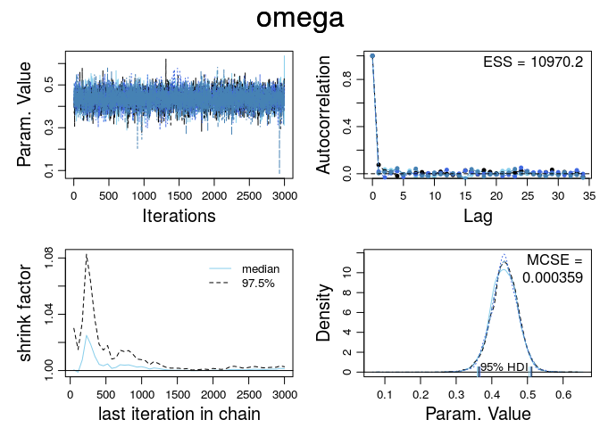
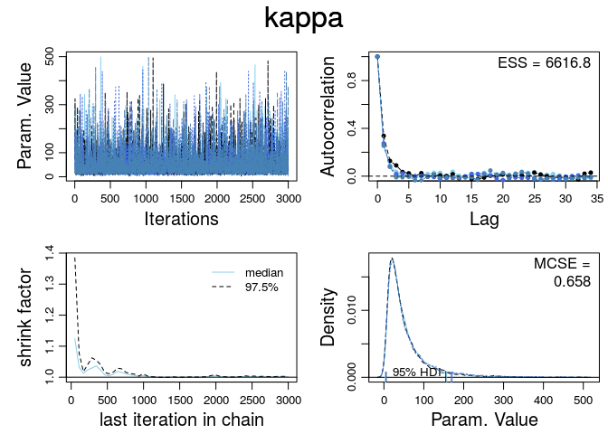
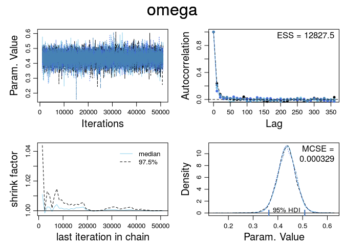
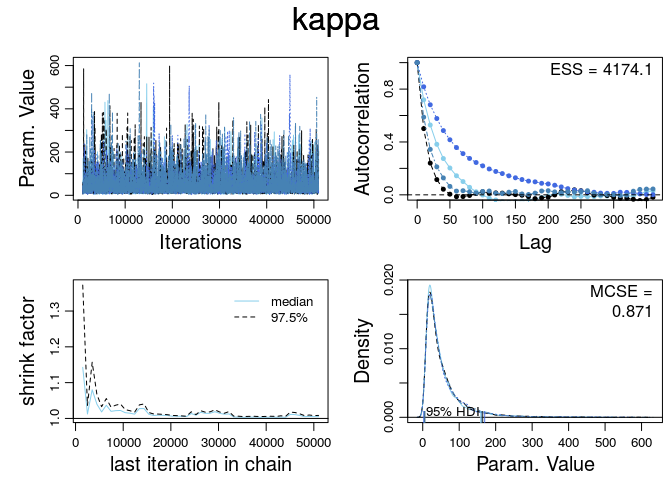

# Ex. 14
Andrey Ziyatdinov  
`r Sys.Date()`  


## Include 

### Include `dbda`


```r
load_all("~/git/variani/dbda/")
```

```

*********************************************************************
Kruschke, J. K. (2015). Doing Bayesian Data Analysis, Second Edition:
A Tutorial with R, JAGS, and Stan. Academic Press / Elsevier.
*********************************************************************
```

## Exercise 14.1

### Data


```r
myData <- read.csv(system.file("data", "TherapeuticTouchData.csv", package = "dbda"))
```

### Stan


```r
StanYdichXnomSsubjMbernBetaOmegaKappa <- function()
{
  out <- list()
  
  oldClass(out) <- "StanYdichXnomSsubjMbernBetaOmegaKappa"
  return(out)
}

mod <- StanYdichXnomSsubjMbernBetaOmegaKappa()

# Generate the MCMC chain:
t1 <- system.time({
  out <- genMCMC(mod, data = myData , sName="s" , yName="y" ,  
    numSavedSteps = 12000, thinSteps=10 )
})

mcmcCoda <- out$codaSamples
stanFit <- out$stanFit           
```


```r
for(p in c("omega","kappa")) { 
  diagMCMC(mcmcCoda, parName = p)
}
```

  


### JAGS


```r
JagsYdichXnomSsubjMbernBetaOmegaKapp <- function()
{
  out <- list()
  
  oldClass(out) <- "JagsYdichXnomSsubjMbernBetaOmegaKapp"
  return(out)
}


mod2 <- JagsYdichXnomSsubjMbernBetaOmegaKapp()

# Generate the MCMC chain:
t2 <- system.time({
  out2 <- genMCMC(mod2, data = myData , sName="s" , yName="y" ,  
    numSavedSteps = 20000, thinSteps=10 )
})
```


```r
for(p in c("omega","kappa")) { 
  diagMCMC(out2, parName = p)
}
```

  
  
### Comparison

CPU time Stan:


```r
t1
```

```
   user  system elapsed 
240.433   3.436 258.267 
```
  CPU time:


```r
t1
```

```
   user  system elapsed 
240.433   3.436 258.267 
```
CPU time JAGS:


```r
t2
```

```
   user  system elapsed 
 89.282   0.036  89.364 
```


