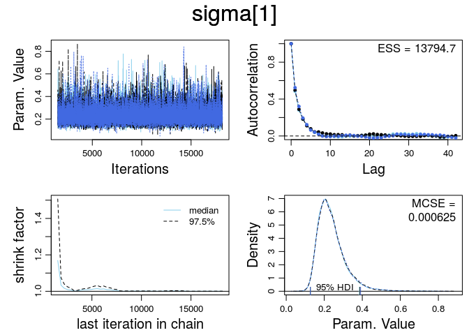
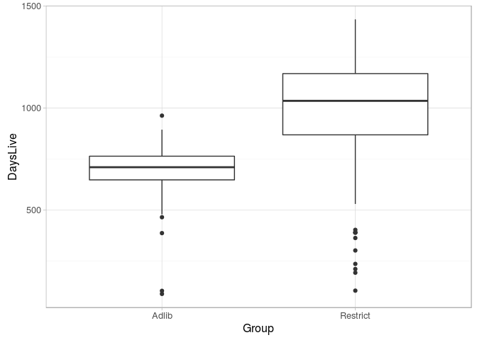

# Ex. 16
Andrey Ziyatdinov  
`r Sys.Date()`  


## Answers

### 16.1

####  Part A

The posterior difference of means has a modal value 0.3, but the 95% HDI does not exclude the ROPE.
On the other hand, the 95% HDI of the effect size clearly excludes the ROPE.
We can conclude that the group difference is large compared to the uncertainty of the estimate.

#### Part B

We would not reject a difference of zero.
We would also not accept a difference of zero because the estimate is very uncertain.

Another important note: the differnce in relative alchochol consumption (part A) is not due to 
the difference in overall consumption. 

## Include 


```r
library(ggplot2)
```

### Include `dbda`


```r
load_all("~/git/variani/dbda/")
```

```

*********************************************************************
Kruschke, J. K. (2015). Doing Bayesian Data Analysis, Second Edition:
A Tutorial with R, JAGS, and Stan. Academic Press / Elsevier.
*********************************************************************
```

### Settings


```r
theme_set(theme_light())
```

## Exercise 16.1

### Data


```r
dat <- read.csv(system.file("data", "ShohatOphirKAMH2012dataReduced.csv", package = "dbda"))
xName <- "Group"
yName <- "PreferenceIndex"
```


```r
ggplot(dat, aes(Group, PreferenceIndex)) + geom_boxplot() 
```

 


```r
ggplot(dat, aes(Group, GrandTotal)) + geom_boxplot() 
```

 

### Part A


```r
JagsYmetXnom2grpMrobustHet <- function()
{
  out <- list()
  
  oldClass(out) <- "JagsYmetXnom2grpMrobustHet"
  return(out)
}

mod <- JagsYmetXnom2grpMrobustHet()

xName <- "Group"
yName <- "PreferenceIndex"

RopeMuDiff <- c(-0.1, 0.1)
RopeSdDiff <- c(-0.1, 0.1)
RopeEff <- c(-0.1, 0.1)

mcmcCoda <- genMCMC(mod, datFrm = dat, yName = yName, xName = xName,
  numSavedSteps = 50000)
```


```r
pnames <- varnames(mcmcCoda)
for(p in pnames) {
  diagMCMC(mcmcCoda, parName = p)
}
```

     


```r
plotMCMC(mod, mcmcCoda , datFrm=dat , yName=yName , xName=xName , 
          RopeMuDiff=RopeMuDiff , RopeSdDiff=RopeSdDiff , RopeEff=RopeEff ,
          pairsPlot=TRUE)
```

  

### Part B

### MCMC


```r
JagsYmetXnom2grpMrobustHet <- function()
{
  out <- list()
  
  oldClass(out) <- "JagsYmetXnom2grpMrobustHet"
  return(out)
}

mod <- JagsYmetXnom2grpMrobustHet()

xName <- "Group"
yName <- "GrandTotal"

RopeMuDiff <- c(-0.1, 0.1)
RopeSdDiff <- c(-0.1, 0.1)
RopeEff <- c(-0.1, 0.1)

mcmcCoda2 <- genMCMC(mod, datFrm = dat, yName = yName, xName = xName,
  numSavedSteps = 50000)
```


```r
plotMCMC(mod, mcmcCoda2 , datFrm=dat , yName=yName , xName=xName , 
          RopeMuDiff=RopeMuDiff , RopeSdDiff=RopeSdDiff , RopeEff=RopeEff ,
          pairsPlot=TRUE)
```

  


## Exercise 16.2 


```r
dat2 <- read.csv(system.file("data", "RatLives.csv", package = "dbda"))
xName <- "Group"
yName <- "DaysLive"

RopeMuDiff <- c(-10, 10)
RopeSdDiff <- c(-5, 5)
RopeEff <- c(-0.1, 0.1)
```


```r
ggplot(dat2, aes(Group, DaysLive)) + geom_boxplot() 
```

 


### MCMC


```r
mcmcCoda3 <- genMCMC(mod, datFrm = dat2, yName = yName, xName = xName,
  numSavedSteps = 50000)
```


```r
plotMCMC(mod, mcmcCoda3 , datFrm=dat2 , yName=yName , xName=xName , 
          RopeMuDiff=RopeMuDiff , RopeSdDiff=RopeSdDiff , RopeEff=RopeEff ,
          pairsPlot=F)
```

 


