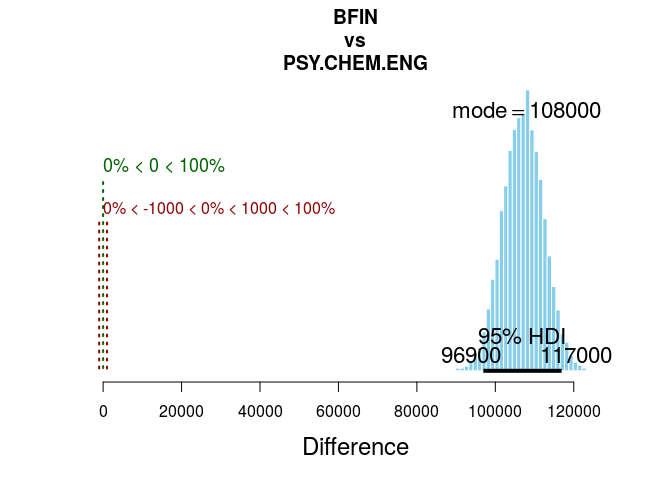
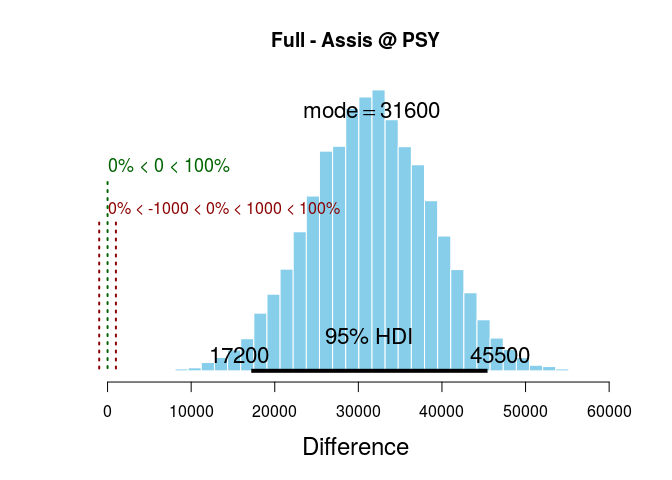
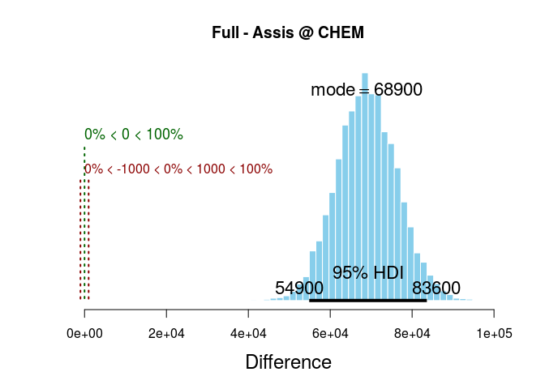

# Ex. 20
Andrey Ziyatdinov  
`r Sys.Date()`  


# Include 


```r
library(ggplot2)
library(gridExtra)
```

## Include `dbda`


```r
load_all("~/git/variani/dbda/")
```

```

*********************************************************************
Kruschke, J. K. (2015). Doing Bayesian Data Analysis, Second Edition:
A Tutorial with R, JAGS, and Stan. Academic Press / Elsevier.
*********************************************************************
```

# Settings


```r
theme_set(theme_light())
```

# Data preparation & Parameter settings

## Data


```r
myDataFrame = read.csv(system.file("data", "Salary.csv", package = "dbda"))

# Re-label and re-order the Pos factor:
myDataFrame$Pos = factor( myDataFrame$Pos , 
                          levels=c("FT3","FT2","FT1","NDW","DST") , 
                          ordered=TRUE , 
                          labels=c("Assis","Assoc","Full","Endow","Disting") )

# Specify the column names in the data file relevant to the analysis:
yName="Salary" 
# x1 should be factor with fewer levels, to plot in single pane:
x1Name="Pos" 
x2Name="Org" 
```

## Model parameters


```r
fileNameRoot = NULL # "SalaryNormalHom-" 
graphFileType = "eps" 
```

## Contrasts


```r
# Specify desired contrasts.
# Each main-effect contrast is a list of 2 vectors of level names, 
# a comparison value (typically 0.0), and a ROPE (which could be NULL):
x1contrasts = list( 
  list( c("Full") , c("Assoc") , compVal=0.0 , ROPE=c(-1000,1000) ) ,
  list( c("Assoc") , c("Assis") , compVal=0.0 , ROPE=c(-1000,1000) ) 
)
x2contrasts = list( 
  list( c("CHEM") , c("ENG") , compVal=0.0 , ROPE=c(-1000,1000) ) ,
  list( c("CHEM") , c("PSY") , compVal=0.0 , ROPE=c(-1000,1000) ) ,
  list( c("BFIN") , c("PSY","CHEM","ENG") , compVal=0.0 , ROPE=c(-1000,1000) ) 
)
# Each interaction contrast is a list of 2 lists of 2 vectors of level names, 
# a comparison value (typically 0.0), and a ROPE (which could be NULL)::
x1x2contrasts = list( 
  list( list( c("Full") , c("Assis") ) ,
        list( c("CHEM") , c("ENG") ) ,
        compVal=0.0 , ROPE=c(-1000,1000) ) ,
  list( list( c("Full") , c("Assis") ) ,
        list( c("CHEM") , c("PSY") ) ,
        compVal=0.0 , ROPE=c(-1000,1000) ) ,
  list( list( c("Full") , c("Assoc","Assis") ) ,
        list( c("BFIN") , c("PSY","CHEM","ENG") ) , 
        compVal=0.0 , ROPE=c(-1000,1000) )
) 
```

# Exercise 20.2

Creating an object of S3 class `JagsYmetXnom2facMnormalHom`:


```r
JagsYmetXnom2facMnormalHom <- function()
{
  out <- list()
  
  oldClass(out) <- "JagsYmetXnom2facMnormalHom"
  return(out)
}

mod <- JagsYmetXnom2facMnormalHom()
```


## Part A


```r
out1 <- genMCMC(mod, myDataFrame, yName, x1Name, x2Name, numSavedSteps = 15000, thinSteps = 5)
```

### Figure 20.3


```r
plotMCMC(mod, out1, myDataFrame, yName, x1Name, x2Name, x2levels = "BFIN")
```

<!-- -->

#### Replicate the code


```r
mat <- as.matrix(out1, chains = TRUE)
par <- varnames(out1) 
```


```r
lvl2 <- "BFIN"

l1 <- levels(myDataFrame[, x1Name])
l2 <- levels(myDataFrame[, x2Name])

ch <- round(seq(1, nrow(mat), length = 10))

p <- ggplot(myDataFrame, aes(as.numeric(Pos), Salary))

for(i in 1:length(l1)) {
  for(j in ch) {
    l1idx <- i
    l2idx <- which(l2 == lvl2)
    v <- paste0("m[", l1idx, ",", l2idx, "]")

    m <- mat[j, v]
    s <- mat[j, "ySigma"]
    
    normlim <- qnorm(c(0.025, 0.975))
    ycomb <- seq(m + normlim[1] * s, m + normlim[2] * s, length = 201)

    ynorm <- dnorm(ycomb, mean = m, sd = s)
    ynorm <- 0.67 * ynorm / max(ynorm) # scale
    
    pf <- data.frame(xp = l1idx - ynorm, yp = ycomb)
    p <- p + geom_path(data = pf, aes(xp, yp), color = "grey50")
  }
  
  # add points
  yp <- subset(myDataFrame, Pos == l1[i] & Org == lvl2, Salary, drop = TRUE)
  if(length(yp) > 0) {
    xp <- i + runif(length(yp), -0.05, 0.05)
    pf <- data.frame(xp = xp, yp = yp)
      
    p <- p + geom_point(data = pf, aes(xp, yp), shape = 1, size = 2)
  }  
}

yr <- range(myDataFrame[, yName])
yr2 <-c(yr[1] - 0.2 * (yr[2] - yr[1]), yr[2] + 0.2 * (yr[2] - yr[1]))
p <- p + ylim(yr2)

p <- p + scale_x_continuous(breaks = 1:length(l1), labels = l1)
p <- p + labs(title = lvl2, x = "Position")
```


```r
p
```

<!-- -->
      
### Figure 20.4


```r
x1c <- list(list("Assoc", "Assis", compVal = 0.0, ROPE = c(-1000, 1000)))
plotMCMC(mod, out1, myDataFrame, yName, x1Name, x2Name, x1contrasts = x1c)
```

<!-- -->

```r
x2c <- list(list("CHEM", "PSY", compVal = 0.0, ROPE = c(-1000, 1000)))
plotMCMC(mod, out1, myDataFrame, yName, x1Name, x2Name, x2contrasts = x2c)
```

<!-- -->

```r
x2c <- list(list("BFIN", c("PSY", "CHEM", "ENG"), compVal = 0.0, ROPE = c(-1000, 1000)))
plotMCMC(mod, out1, myDataFrame, yName, x1Name, x2Name, x2contrasts = x2c)
```

<!-- -->

#### Replicating the code

See Section 19.3.3 Contrasts of the book (p. 565).


```r
x1 <- as.numeric(as.factor(myDataFrame[,x1Name])) 
x1levels <- levels(as.factor(myDataFrame[,x1Name]))
x2 <- as.numeric(as.factor(myDataFrame[,x2Name]))
x2levels <- levels(as.factor(myDataFrame[,x2Name]))

l1 <- levels(myDataFrame[, x1Name])
l2 <- levels(myDataFrame[, x2Name])
     
contr <- list("BFIN", c("PSY", "CHEM", "ENG"), compVal = 0.0, ROPE = c(-1000, 1000))

x2right <- contr[[1]]
v <- paste0("b2[", which(l2 %in% x2right), "]")

if(length(v) == 1) {
  right <- mat[, v]
} else {
  right <- rowSums(mat[, v]) / length(v)
}

x2left <- contr[[2]]

v <- paste0("b2[", which(l2 %in% x2left), "]")
if(length(v) == 1) {
  left <- mat[, v]
} else {
  left <- rowSums(mat[, v]) / length(v)
}

postContrast <- right - left
```


```r
plotPost(postContrast, xlab = "Difference", 
  main = paste0(paste(contr[[1]], collapse = "."), "\nvs\n", paste(contr[[2]], collapse = ".")),
  compVal = contr$compVal, ROPE = contr$ROPE)
```

<!-- -->

```
                ESS     mean   median     mode hdiMass   hdiLow  hdiHigh
Difference 13028.15 107143.6 107186.5 107410.4    0.95 97385.27 117367.1
           compVal pGtCompVal ROPElow ROPEhigh pLtROPE pInROPE pGtROPE
Difference       0          1   -1000     1000       0       0       1
```

### Figure 20.5


```r
l1 <- levels(myDataFrame[, x1Name])
l2 <- levels(myDataFrame[, x2Name])

x11 <- "Full"
x12 <- "Assis"
x2 <- "PSY"

x11idx <- which(l1 == x11)
x12idx <- which(l1 == x12)
x2idx <- which(l2 == x2)
    
v11 <- paste0("m[", x11idx, ",", x2idx, "]")
v12 <- paste0("m[", x12idx, ",", x2idx, "]")

postDiff <- mat[, v11] - mat[, v12]
```


```r
plotPost(postDiff, xlab = "Difference", 
  main = paste0(x11, " - ", x12, " @ ", x2),
  compVal = 0, ROPE = c(-1000, 1000))
```

<!-- -->

```
             ESS     mean   median     mode hdiMass   hdiLow  hdiHigh
Difference 15000 31360.16 31403.86 31437.66    0.95 16781.77 45188.49
           compVal pGtCompVal ROPElow ROPEhigh pLtROPE      pInROPE
Difference       0  0.9999333   -1000     1000       0 6.666667e-05
             pGtROPE
Difference 0.9999333
```


```r
l1 <- levels(myDataFrame[, x1Name])
l2 <- levels(myDataFrame[, x2Name])

x11 <- "Full"
x12 <- "Assis"
x2 <- "CHEM"

x11idx <- which(l1 == x11)
x12idx <- which(l1 == x12)
x2idx <- which(l2 == x2)
    
v11 <- paste0("m[", x11idx, ",", x2idx, "]")
v12 <- paste0("m[", x12idx, ",", x2idx, "]")

postDiff <- mat[, v11] - mat[, v12]
```


```r
plotPost(postDiff, xlab = "Difference", 
  main = paste0(x11, " - ", x12, " @ ", x2),
  compVal = 0, ROPE = c(-1000, 1000))
```

<!-- -->

```
                ESS     mean   median     mode hdiMass   hdiLow  hdiHigh
Difference 11988.86 68846.51 68852.76 69621.95    0.95 54411.11 82777.08
           compVal pGtCompVal ROPElow ROPEhigh pLtROPE pInROPE pGtROPE
Difference       0          1   -1000     1000       0       0       1
```

```r
x12c <- list(list(list("Full", "Assis"), list("CHEM", "PSY"), compVal = 0.0, ROPE = c(-1000, 1000)))
plotMCMC(mod, out1, myDataFrame, yName, x1Name, x2Name, x1x2contrasts = x12c)
```

<!-- -->


