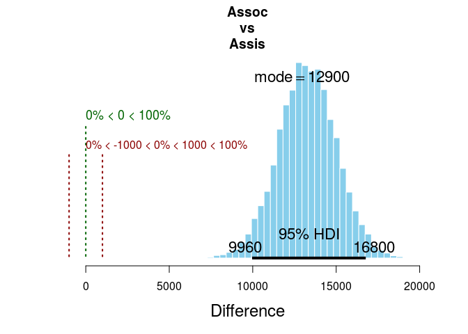

# Ex. 20
Andrey Ziyatdinov  
`r Sys.Date()`  


# Include 


```r
library(ggplot2)
library(gridExtra)
```

## Include `dbda`


```r
load_all("~/git/variani/dbda/")
```

```

*********************************************************************
Kruschke, J. K. (2015). Doing Bayesian Data Analysis, Second Edition:
A Tutorial with R, JAGS, and Stan. Academic Press / Elsevier.
*********************************************************************
```

# Settings


```r
theme_set(theme_light())
```

# Data preparation & Parameter settings

## Data


```r
myDataFrame = read.csv(system.file("data", "Salary.csv", package = "dbda"))

# Re-label and re-order the Pos factor:
myDataFrame$Pos = factor( myDataFrame$Pos , 
                          levels=c("FT3","FT2","FT1","NDW","DST") , 
                          ordered=TRUE , 
                          labels=c("Assis","Assoc","Full","Endow","Disting") )

# Specify the column names in the data file relevant to the analysis:
yName="Salary" 
# x1 should be factor with fewer levels, to plot in single pane:
x1Name="Pos" 
x2Name="Org" 
```

## Model parameters


```r
fileNameRoot = NULL # "SalaryNormalHom-" 
graphFileType = "eps" 
```

## Contrasts


```r
# Specify desired contrasts.
# Each main-effect contrast is a list of 2 vectors of level names, 
# a comparison value (typically 0.0), and a ROPE (which could be NULL):
x1contrasts = list( 
  list( c("Full") , c("Assoc") , compVal=0.0 , ROPE=c(-1000,1000) ) ,
  list( c("Assoc") , c("Assis") , compVal=0.0 , ROPE=c(-1000,1000) ) 
)
x2contrasts = list( 
  list( c("CHEM") , c("ENG") , compVal=0.0 , ROPE=c(-1000,1000) ) ,
  list( c("CHEM") , c("PSY") , compVal=0.0 , ROPE=c(-1000,1000) ) ,
  list( c("BFIN") , c("PSY","CHEM","ENG") , compVal=0.0 , ROPE=c(-1000,1000) ) 
)
# Each interaction contrast is a list of 2 lists of 2 vectors of level names, 
# a comparison value (typically 0.0), and a ROPE (which could be NULL)::
x1x2contrasts = list( 
  list( list( c("Full") , c("Assis") ) ,
        list( c("CHEM") , c("ENG") ) ,
        compVal=0.0 , ROPE=c(-1000,1000) ) ,
  list( list( c("Full") , c("Assis") ) ,
        list( c("CHEM") , c("PSY") ) ,
        compVal=0.0 , ROPE=c(-1000,1000) ) ,
  list( list( c("Full") , c("Assoc","Assis") ) ,
        list( c("BFIN") , c("PSY","CHEM","ENG") ) , 
        compVal=0.0 , ROPE=c(-1000,1000) )
) 
```

# Exercise 20.2

Creating an object of S3 class `JagsYmetXnom2facMnormalHom`:


```r
JagsYmetXnom2facMnormalHom <- function()
{
  out <- list()
  
  oldClass(out) <- "JagsYmetXnom2facMnormalHom"
  return(out)
}

mod <- JagsYmetXnom2facMnormalHom()
```


## Part A


```r
out1 <- genMCMC(mod, myDataFrame, yName, x1Name, x2Name, numSavedSteps = 15000, thinSteps = 5)
```

### Figure 20.4


```r
x1c <- list(list("Assoc", "Assis", compVal = 0.0, ROPE = c(-1000, 1000)))
plotMCMC(mod, out1, myDataFrame, yName, x1Name, x2Name, x1contrasts = x1c)
```

<!-- -->

```r
x2c <- list(list("CHEM", "PSY", compVal = 0.0, ROPE = c(-1000, 1000)))
plotMCMC(mod, out1, myDataFrame, yName, x1Name, x2Name, x2contrasts = x2c)
```

<!-- -->

```r
x2c <- list(list("BFIN", c("PSY", "CHEM", "ENG"), compVal = 0.0, ROPE = c(-1000, 1000)))
plotMCMC(mod, out1, myDataFrame, yName, x1Name, x2Name, x2contrasts = x2c)
```

<!-- -->

