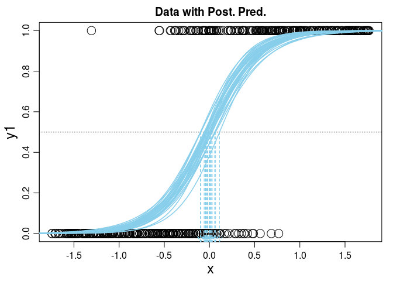
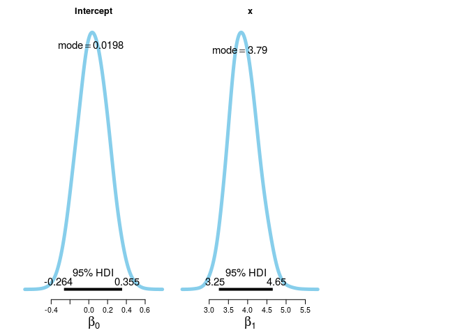
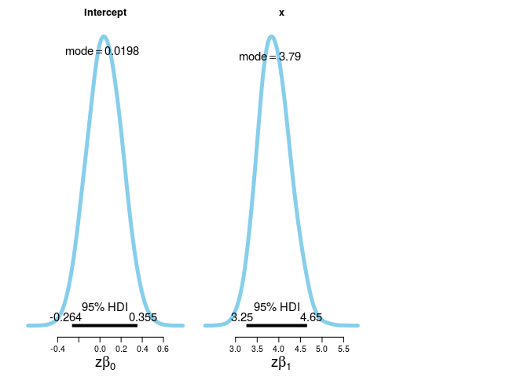
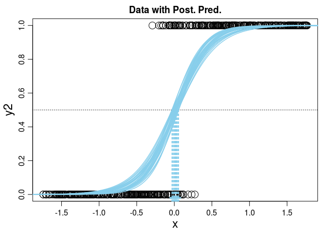
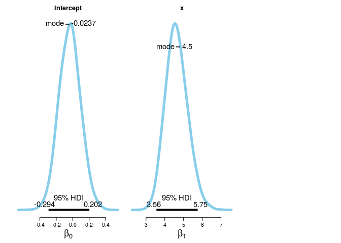
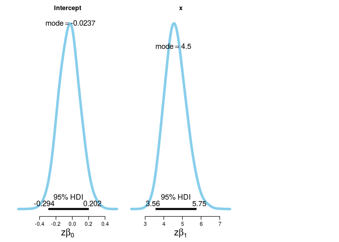

# Comparison between logit and probit
Andrey Ziyatdinov  
`r Sys.Date()`  


## Include 


```r
library(ggplot2)
library(gridExtra)
```

### Include `dbda`


```r
load_all("~/git/variani/dbda/")
```

```

*********************************************************************
Kruschke, J. K. (2015). Doing Bayesian Data Analysis, Second Edition:
A Tutorial with R, JAGS, and Stan. Academic Press / Elsevier.
*********************************************************************
```

### Settings


```r
theme_set(theme_light())
```

## Inverse link functions


```r
ilogit <- function(x) 1 / (1 + exp(-x))
iprobit <- binomial(link="probit")$linkinv
iprobit
```

```
function (eta) 
{
    thresh <- -qnorm(.Machine$double.eps)
    eta <- pmin(pmax(eta, -thresh), thresh)
    pnorm(eta)
}
<environment: namespace:stats>
```

## Data set


```r
set.seed(1)
N <- 500

b0 <- 0
b1 <- 4

x <- runif(N)
x <- (x - mean(x)) / sd(x)

mu1 <- ilogit(b0 + b1*x)
mu2 <- iprobit(b0 + b1*x)

y1 <- rep(NA, N)
y2 <- rep(NA, N)
for(i in 1:length(x)) {
  y1[i] <- sample(c(0, 1), size = 1, prob = c(1 - mu1[i], mu1[i]))
  y2[i] <- sample(c(0, 1), size = 1, prob = c(1 - mu2[i], mu2[i]))
}

dat <- data.frame(y1 = y1, y2 = y2, x = x, mu1 = mu1, mu2 = mu2)
```

#### Logit/Probit functions on x


```r
pdat <- data.frame(x = x,
  ilogit = ilogit(b0 + b1*x),
  iprobit = iprobit(b0 + b1*x))

ggplot(pdat, aes(x, ilogit)) + geom_point() + geom_point(aes(x, iprobit), color = 'red')
```

 

## Two logit and probit models


```r
JagsYdichXmetMultiMlogistic <- function()
{
  out <- list()
  oldClass(out) <- "JagsYdichXmetMultiMlogistic"

  return(out)
}

mod <- JagsYdichXmetMultiMlogistic() 
```


```r
out11 <- genMCMC(mod, dat, xName = "x", yName = "y1", numSavedSteps = 5000, thinSteps = 5, invlink = "ilogit")
out12 <- genMCMC(mod, dat, xName = "x", yName = "y2", numSavedSteps = 5000, thinSteps = 5, invlink = "iprobit")
```

### Plot logit model


```r
plotMCMC(mod, out11, dat, xName = "x", yName = "y1", showCurve = TRUE) 
```

   

### Plot probit model


```r
plotMCMC(mod, out12, dat, xName = "x", yName = "y2", showCurve = TRUE) 
```

   

