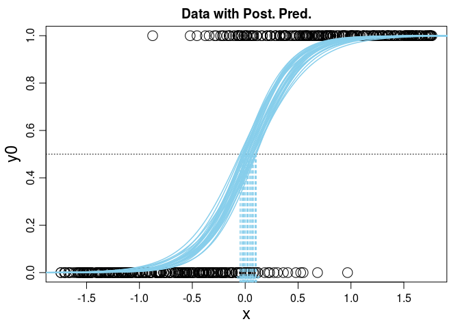
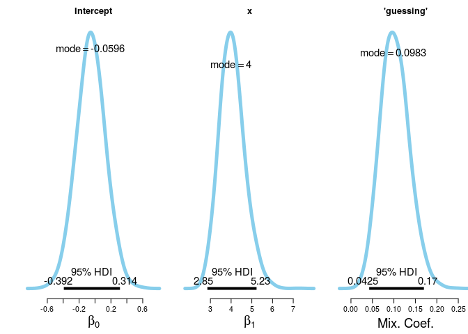

# Ex. 21
Andrey Ziyatdinov  
`r Sys.Date()`  


## Answers

### 21.1

#### Part B

In the non-robust logistic regression, the posterior distribution of  `beta1` has mode 2.33 and 95% HDI from 1.95 to 2.7.
The true value of `beta1` used in simulation was 4, and it is clearly excluded from the HDI interval.

Interestingly, the same analysis with a clean simulation model (no outliers) reveals the estimation of `beta1`
with mode 4.3 and 95% HDI from 3.61 to 5.22. We see that the tru value is inside the HDI interval, but the precision is low.
The low precision can be attributted to the low sample size (N = 500) and the loss of relationships in data sample, 
when applying the logistic function in data simulation process.

#### Part C

In the robust logistic regression, the posterior distribution of  `beta1` has mode 3.43 and 95% HDI from 2.46 to 4.88.
The true value of `beta1` used in simulation was 4, and it is isnide the HDI interval.
The estimation of `beta1` in the robust model describes the simulation model correctly, 
but the the downward bias in estimation of `beta1`.

The mixing coefficient is estimated reasonably well. Thus, I would conclude that the loss in precision is mainly due to 
the "logistic" nature of data simulation. That seems a true explanation, taking into account that the same results were
obtained for the clean data simulation model (no outliers): the downward bias in estimation of `beta1`.

The evil of the "logistic" data simulation is on that points, which have `mu` around 0.5. Hence, generation of true negatives and false positives 
occur more frequently.

The expected bahaviour of the logistic curve on the Figures is shown.
The slope is more steep in the case of the robust model.

#### Part D

Contrary to the tips in the book, the robust model was able to recover the true value of `beta1`.
The posterior distribution of  `beta1` has mode 4 and 95% HDI from 2.85 to 5.23.
The true value of `beta1` used in simulation was 4.
The posterior distribution of  `guessing` parameter has mode 0.01 and 95% HDI from 0.04 to 0.17,
while the true value of `guessing` used in simulation was 0.1.


## Include 


```r
library(ggplot2)
library(gridExtra)
```

### Include `dbda`


```r
load_all("~/git/variani/dbda/")
```

```

*********************************************************************
Kruschke, J. K. (2015). Doing Bayesian Data Analysis, Second Edition:
A Tutorial with R, JAGS, and Stan. Academic Press / Elsevier.
*********************************************************************
```

### Settings


```r
theme_set(theme_light())
```

## Exercise 21.1


### Part A


```r
set.seed(1)
N <- 500

b0 <- 0
b1 <- 4
guess <- 0.1
guess2 <- 0.5

x <- runif(N)
x <- (x - mean(x)) / sd(x)

mu0 <- 1 / (1 + exp(-(b0 + b1*x)))
mu <- guess * 0.5 + (1 - guess) * 1 / (1 + exp(-(b0 + b1*x)))
mu2 <- guess2 * 0.5 + (1 - guess2) * 1 / (1 + exp(-(b0 + b1*x)))

y <- rep(NA, N)
y0 <- rep(NA, N)
for(i in 1:length(x)) {
  y[i] <- sample(c(0, 1), size = 1, prob = c(1 - mu[i], mu[i]))
  y0[i] <- sample(c(0, 1), size = 1, prob = c(1 - mu0[i], mu0[i]))
}

dat <- data.frame(y = y, y0 = y0, x = x, mu = mu, mu2 = mu2, mu0 = mu0)
```

#### Logit function on x


```r
plot(x, 1 / (1 + exp(-(b0 + b1*x))))
```

 

#### Summary data

The points with at extremes (0 or 1) are more definitive.
The more points at near 0.5 the more difficult is to take a decision.


```r
f1 <- function(x) sum(x < 0.1 | x > 0.9) / length(x)

f1(dat$mu0)
```

```
[1] 0.676
```

```r
f1(dat$mu)
```

```
[1] 0.588
```

```r
f1(dat$mu2)
```

```
[1] 0
```

The distribution of mu is between 0 and 1 only if guess = 0.
Otherwise, the random values around 0.5 have more mass.


```r
range(dat$mu0)
```

```
[1] 0.0009370325 0.9991463181
```

```r
range(dat$mu)
```

```
[1] 0.05084333 0.94923169
```

```r
range(dat$mu2)
```

```
[1] 0.2504685 0.7495732
```

See the same distribution on histograms.


```r
grid.arrange(qplot(dat$mu0) + xlim(0, 1) + ggtitle("guess = 0"), 
  qplot(dat$mu) + xlim(0, 1) + ggtitle("guess = 0.1"), 
  qplot(dat$mu2) + xlim(0, 1) + ggtitle("guess = 0.5"), 
  ncol = 1)
```

 


#### Plot data


```r
grid.arrange(
  ggplot(dat, aes(mu0, mu)) + geom_point(),
  ggplot(dat, aes(x, log(mu0/(1-mu0)))) + geom_point() + ggtitle("guess = 0"),
  ggplot(dat, aes(x, log(mu/(1-mu)))) + geom_point() + ggtitle("guess = 0.1"),
  ggplot(dat, aes(x, log(mu2/(1-mu2)))) + geom_point() + ggtitle("guess = 0.5"),
  ncol = 2)
```

 

### Part B: Logistic regression

#### Compute models


```r
JagsYdichXmetMultiMlogistic <- function()
{
  out <- list()
  oldClass(out) <- "JagsYdichXmetMultiMlogistic"

  return(out)
}

mod <- JagsYdichXmetMultiMlogistic()   

out <- genMCMC(mod, dat, xName="x" , yName="y" , 
  numSavedSteps=10000 , thinSteps=1)                 
```


```r
out0 <- genMCMC(mod, dat, xName="x" , yName="y0", 
  numSavedSteps=10000 , thinSteps=1)               
```

#### Plot clean model


```r
plotMCMC(mod, out0 , dat , xName="x" , yName="y0",
  showCurve=T) 
```

   

#### Plot noisy model


```r
plotMCMC(mod, out , dat , xName="x" , yName="y",
  showCurve=T) 
```

   

### Part C: Robust Logistic regression

#### Compute models


```r
JagsYdichXmetMultiMlogisticRobust <- function()
{
  out <- list()
  oldClass(out) <- "JagsYdichXmetMultiMlogisticRobust"

  return(out)
}

mod2 <- JagsYdichXmetMultiMlogisticRobust()   

out2 <- genMCMC(mod2, dat, xName="x" , yName="y" , 
  numSavedSteps=10000 , thinSteps=1)                 
```


```r
out20 <- genMCMC(mod2, dat, xName="x" , yName="y0", 
  numSavedSteps=10000 , thinSteps=1)               
```

#### Plot models


```r
plotMCMC(mod2, out2 , dat , xName="x" , yName="y0",
  showCurve=T) 
```

   


```r
plotMCMC(mod2, out20 , dat , xName="x" , yName="y0",
  showCurve=T) 
```

   


### Part D


```r
set.seed(1)
N <- 500

b0 <- 0
b1 <- 4
guess <- 0.1

x <- rnorm(N)
x <- (x - mean(x)) / sd(x)

mu0 <- 1 / (1 + exp(-(b0 + b1*x)))
mu <- guess * 0.5 + (1 - guess) * 1 / (1 + exp(-(b0 + b1*x)))

y <- rep(NA, N)
y0 <- rep(NA, N)
for(i in 1:length(x)) {
  y[i] <- sample(c(0, 1), size = 1, prob = c(1 - mu[i], mu[i]))
  y0[i] <- sample(c(0, 1), size = 1, prob = c(1 - mu0[i], mu0[i]))
}

dat2 <- data.frame(y = y, y0 = y0, x = x, mu = mu, mu0 = mu0)
```

#### Differences in `x`


```r
grid.arrange(
  ggplot(dat, aes(x)) + geom_histogram() + xlim(c(-3, 3)) + ggtitle("dat: x = runif(N)"),  
  ggplot(dat2, aes(x)) + geom_histogram() + xlim(c(-3, 3)) + ggtitle("dat2: x = rnorm(N)"),
  ncol = 1)
```

 


```r
grid.arrange(
  ggplot(dat, aes(mu)) + geom_histogram() + xlim(c(0, 1)) + ggtitle("dat: x = runif(N)"),  
  ggplot(dat2, aes(mu)) + geom_histogram() + xlim(c(0, 1)) + ggtitle("dat2: x = rnorm(N)"),
  ncol = 1)
```

 


#### Compute models


```r
out30 <- genMCMC(mod, dat2, xName="x" , yName="y0", 
  numSavedSteps = 10000, thinSteps = 1) 
```


```r
out3 <- genMCMC(mod2, dat2, xName="x" , yName="y", 
  numSavedSteps = 10000, thinSteps = 1) 
```

#### Plot clean model


```r
plotMCMC(mod, out30 , dat2 , xName="x" , yName="y0",
  showCurve=T) 
```

   

#### Plot model with noise


```r
plotMCMC(mod2, out3 , dat2 , xName="x" , yName="y",
  showCurve=T) 
```

   

### Additional simulations

Let increase the sample size from 500 to 5000.


```r
set.seed(1)
N <- 5000

b0 <- 0
b1 <- 4
guess <- 0.1

x <- rnorm(N)
x <- (x - mean(x)) / sd(x)

mu0 <- 1 / (1 + exp(-(b0 + b1*x)))
mu <- guess * 0.5 + (1 - guess) * 1 / (1 + exp(-(b0 + b1*x)))

y <- rep(NA, N)
y0 <- rep(NA, N)
for(i in 1:length(x)) {
  y[i] <- sample(c(0, 1), size = 1, prob = c(1 - mu[i], mu[i]))
  y0[i] <- sample(c(0, 1), size = 1, prob = c(1 - mu0[i], mu0[i]))
}

dat3 <- data.frame(y = y, y0 = y0, x = x, mu = mu, mu0 = mu0)
```

#### Differences in `x`


```r
grid.arrange(
  ggplot(dat, aes(x)) + geom_histogram() + xlim(c(-3, 3)) + ggtitle("dat: x = runif(N = 500)"),  
  ggplot(dat3, aes(x)) + geom_histogram() + xlim(c(-3, 3)) + ggtitle("dat3: x = rnorm(N = 5,000)"),
  ncol = 1)
```

 


```r
grid.arrange(
  ggplot(dat, aes(mu)) + geom_histogram() + xlim(c(0, 1)) + ggtitle("dat: x = runif(N = 500)"),  
  ggplot(dat3, aes(mu)) + geom_histogram() + xlim(c(0, 1)) + ggtitle("dat2: x = rnorm(N = 5,000)"),
  ncol = 1)
```

 


```r
f1 <- function(x) sum(x < 0.1 | x > 0.9) / length(x)

f1(dat$mu)
```

```
[1] 0.588
```

```r
f1(dat3$mu)
```

```
[1] 0.4744
```


