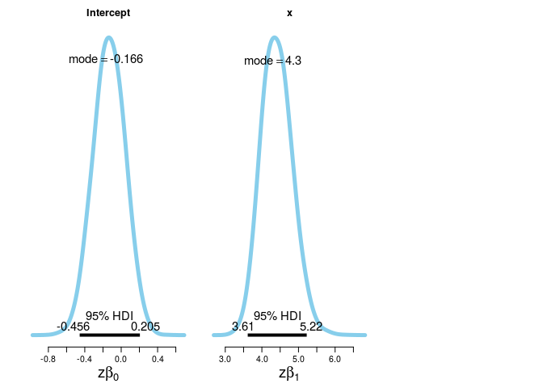
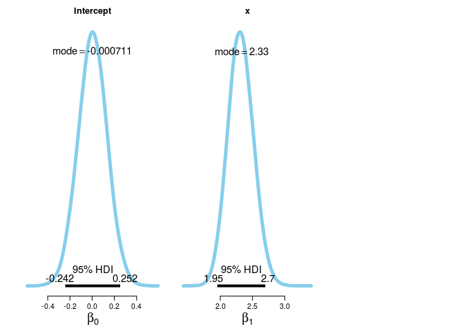

# Ex. 21
Andrey Ziyatdinov  
`r Sys.Date()`  


## Answers

### 21.1

## Include 


```r
library(ggplot2)
library(gridExtra)
```

### Include `dbda`


```r
load_all("~/git/variani/dbda/")
```

```

*********************************************************************
Kruschke, J. K. (2015). Doing Bayesian Data Analysis, Second Edition:
A Tutorial with R, JAGS, and Stan. Academic Press / Elsevier.
*********************************************************************
```

### Settings


```r
theme_set(theme_light())
```

## Exercise 21.1


### Part A


```r
N <- 500

b0 <- 0
b1 <- 4
guess <- 0.1
guess2 <- 0.5

x <- runif(N)
x <- (x - mean(x)) / sd(x)

mu0 <- 1 / (1 + exp(-(b0 + b1*x)))
mu <- guess * 0.5 + (1 - guess) * 1 / (1 + exp(-(b0 + b1*x)))
mu2 <- guess2 * 0.5 + (1 - guess2) * 1 / (1 + exp(-(b0 + b1*x)))

y <- rep(NA, N)
y0 <- rep(NA, N)
for(i in 1:length(x)) {
  y[i] <- sample(c(0, 1), size = 1, prob = c(1 - mu[i], mu[i]))
  y0[i] <- sample(c(0, 1), size = 1, prob = c(1 - mu0[i], mu0[i]))
}

dat <- data.frame(y = y, y0 = y0, x = x, mu = mu, mu2 = mu2, mu3 = mu3, mu0 = mu0)
```

#### Summary data

The points with at extremes (0 or 1) are more definitive.
The more points at near 0.5 the more difficult is to take a decision.


```r
f1 <- function(x) sum(x < 0.1 | x > 0.9) / length(x)

f1(dat$mu0)
```

```
[1] 0.664
```

```r
f1(dat$mu)
```

```
[1] 0.578
```

```r
f1(dat$mu2)
```

```
[1] 0
```

The distribution of mu is between 0 and 1 only if guess = 0.
Otherwise, the random values around 0.5 have more mass.


```r
range(dat$mu0)
```

```
[1] 0.001175921 0.999260354
```

```r
range(dat$mu)
```

```
[1] 0.05105833 0.94933432
```

```r
range(dat$mu2)
```

```
[1] 0.2505880 0.7496302
```


#### Plot data


```r
ggplot(dat, aes(mu0, mu)) + geom_point()
```

 

```r
ggplot(dat, aes(log(mu0/(1-mu0)), log(mu/(1-mu)))) + geom_point()
```

 

```r
ggplot(dat, aes(x, log(mu0/(1-mu0)))) + geom_point() + ggtitle("guess = 0")
```

 

```r
ggplot(dat, aes(x, log(mu/(1-mu)))) + geom_point() + ggtitle("guess = 0.1")
```

 

```r
ggplot(dat, aes(x, log(mu2/(1-mu2)))) + geom_point() + ggtitle("guess = 0.5")
```

 

### Part B


```r
JagsYdichXmetMultiMlogistic <- function()
{
  out <- list()
  oldClass(out) <- "JagsYdichXmetMultiMlogistic"

  return(out)
}

mod <- JagsYdichXmetMultiMlogistic()   

out <- genMCMC(mod, dat, xName="x" , yName="y" , 
  numSavedSteps=10000 , thinSteps=1)                 
```


```r
out0 <- genMCMC(mod, dat, xName="x" , yName="y0", 
  numSavedSteps=10000 , thinSteps=1)               
```


```r
plotMCMC(mod, out0 , dat , xName="x" , yName="y0",
  showCurve=T) 
```

   


```r
plotMCMC(mod, out , dat , xName="x" , yName="y",
  showCurve=T) 
```

   


