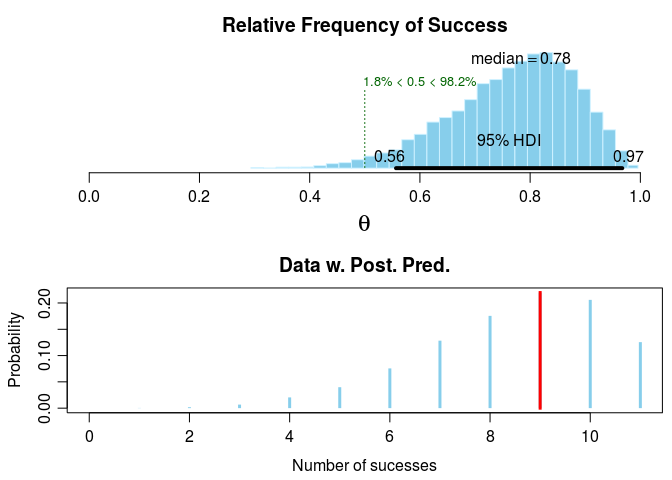
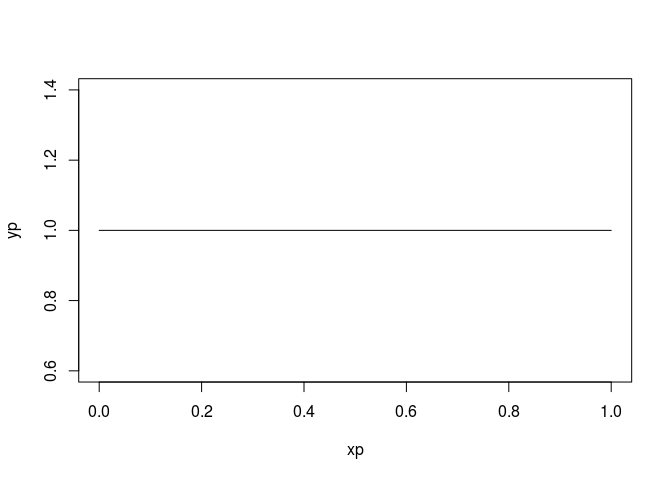
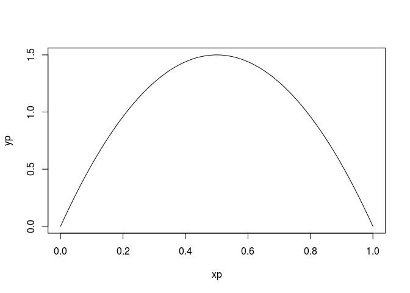

# Examples from BayesianFirstAid R package based on rjags
Andrey Ziyatdinov  
`r Sys.Date()`  


# About

The idea is to go through tests implemented in [Bayesian First Aid](https://github.com/rasmusab/bayesian_first_aid) R package
and try different Baeysian engines: rjags (used by Bayesian First Aid), rstan and pystan.
So, well-known statistical tests in the Bayesian fashion will help to learn the syntaxes of different tools.
This document shows code for rjags.

As stated in Bayesian First Aid [page](https://github.com/rasmusab/bayesian_first_aid):

Currently Bayesian First Aid implements five alternative models to classical tests. Each of these alternative models are described in detail on my blog (see links below):

* Binomial Test: bayes.binom.test(x, n) . [Code example and details](http://sumsar.net/blog/2014/01/bayesian-first-aid-binomial-test/)
* One Sample and Paired Samples t-test: bayes.t.test(x) . [Code example and details](http://sumsar.net/blog/2014/02/bayesian-first-aid-one-sample-t-test/)
* Two Sample t-test: bayes.t.test(x, y) . Code example and details
* Pearson Correlation Test: bayes.cor.test(x, y) . Code example and details
* Test of Proportions: bayes.prop.test(x, n) . Code example and details
* Poisson test: bayes.poisson.test(x, T) . Code example and details

# Include


```r
library(BayesianFirstAid)
```

# Binomial Test


```r
fitb <- bayes.binom.test(c(9, 2))
fitb
```

```

	Bayesian First Aid binomial test

data: c(9, 2)
number of successes = 9, number of trials = 11
Estimated relative frequency of success:
  0.78 
95% credible interval:
  0.56 0.97 
The relative frequency of success is more than 0.5 by a probability of 0.982 
and less than 0.5 by a probability of 0.018 
```


```r
plot(fitb)
```

 

Model code in rjags:


```r
model.code(fitb)
```

```
### Model code for the Bayesian First Aid alternative to the binomial test ###
require(rjags)

# Setting up the data
x <- 9 
n <- 11 

# The model string written in the JAGS language
model_string <- "model {
  x ~ dbinom(theta, n)
  theta ~ dbeta(1, 1)
  x_pred ~ dbinom(theta, n)
}"

# Running the model
model <- jags.model(textConnection(model_string), data = list(x = x, n = n), 
                    n.chains = 3, n.adapt=1000)
samples <- coda.samples(model, c("theta", "x_pred"), n.iter=5000)

# Inspecting the posterior
plot(samples)
summary(samples)  
```

## Not a uniform prior

The default flat prior used in the example above.


```r
xp <- seq(0, 1, length = 100)
yp <- dbeta(xp, 1, 1)
plot(xp, yp, t = 'l')
```

 

Let's try another one `beta(2, 2)`.


```r
xp <- seq(0, 1, length = 100)
yp <- dbeta(xp, 2, 2)
plot(xp, yp, t = 'l')
```

 

The `rjags` code is:


```r
# Setting up the data
x <- 9 
n <- 11 

# The model string written in the JAGS language
model_string <- "model {
  x ~ dbinom(theta, n)
  theta ~ dbeta(2, 2)
  x_pred ~ dbinom(theta, n)
}"

# Running the model
model <- jags.model(textConnection(model_string), data = list(x = x, n = n), 
                    n.chains = 3, n.adapt=1000)
```

```
Compiling model graph
   Resolving undeclared variables
   Allocating nodes
Graph information:
   Observed stochastic nodes: 1
   Unobserved stochastic nodes: 2
   Total graph size: 6

Initializing model
```

```r
samples <- coda.samples(model, c("theta", "x_pred"), n.iter=5000)
```

```

  |                                                        
  |                                                  |   0%
  |                                                        
  |*                                                 |   2%
  |                                                        
  |**                                                |   4%
  |                                                        
  |***                                               |   6%
  |                                                        
  |****                                              |   8%
  |                                                        
  |*****                                             |  10%
  |                                                        
  |******                                            |  12%
  |                                                        
  |*******                                           |  14%
  |                                                        
  |********                                          |  16%
  |                                                        
  |*********                                         |  18%
  |                                                        
  |**********                                        |  20%
  |                                                        
  |***********                                       |  22%
  |                                                        
  |************                                      |  24%
  |                                                        
  |*************                                     |  26%
  |                                                        
  |**************                                    |  28%
  |                                                        
  |***************                                   |  30%
  |                                                        
  |****************                                  |  32%
  |                                                        
  |*****************                                 |  34%
  |                                                        
  |******************                                |  36%
  |                                                        
  |*******************                               |  38%
  |                                                        
  |********************                              |  40%
  |                                                        
  |*********************                             |  42%
  |                                                        
  |**********************                            |  44%
  |                                                        
  |***********************                           |  46%
  |                                                        
  |************************                          |  48%
  |                                                        
  |*************************                         |  50%
  |                                                        
  |**************************                        |  52%
  |                                                        
  |***************************                       |  54%
  |                                                        
  |****************************                      |  56%
  |                                                        
  |*****************************                     |  58%
  |                                                        
  |******************************                    |  60%
  |                                                        
  |*******************************                   |  62%
  |                                                        
  |********************************                  |  64%
  |                                                        
  |*********************************                 |  66%
  |                                                        
  |**********************************                |  68%
  |                                                        
  |***********************************               |  70%
  |                                                        
  |************************************              |  72%
  |                                                        
  |*************************************             |  74%
  |                                                        
  |**************************************            |  76%
  |                                                        
  |***************************************           |  78%
  |                                                        
  |****************************************          |  80%
  |                                                        
  |*****************************************         |  82%
  |                                                        
  |******************************************        |  84%
  |                                                        
  |*******************************************       |  86%
  |                                                        
  |********************************************      |  88%
  |                                                        
  |*********************************************     |  90%
  |                                                        
  |**********************************************    |  92%
  |                                                        
  |***********************************************   |  94%
  |                                                        
  |************************************************  |  96%
  |                                                        
  |************************************************* |  98%
  |                                                        
  |**************************************************| 100%
```

```r
sf <- BayesianFirstAid:::mcmc_stats(samples)
sf
```

```
            mean       sd HDI% comp     HDIlo      HDIup    %>comp
theta  0.7317639 0.111367   95    0 0.5083132  0.9260312 0.9999333
x_pred 8.0516000 1.878964   95    0 5.0000000 11.0000000 0.9999333
             %<comp     q2.5%      q25%   median      q75%     q97.5%
theta  6.665778e-05 0.4876219 0.6594532 0.744572 0.8146949  0.9145483
x_pred 6.665778e-05 4.0000000 7.0000000 8.000000 9.0000000 11.0000000
           mcmc_se      Rhat n_eff
theta  0.000915801 0.9999610 14801
x_pred 0.015475812 0.9998858 14766
```

