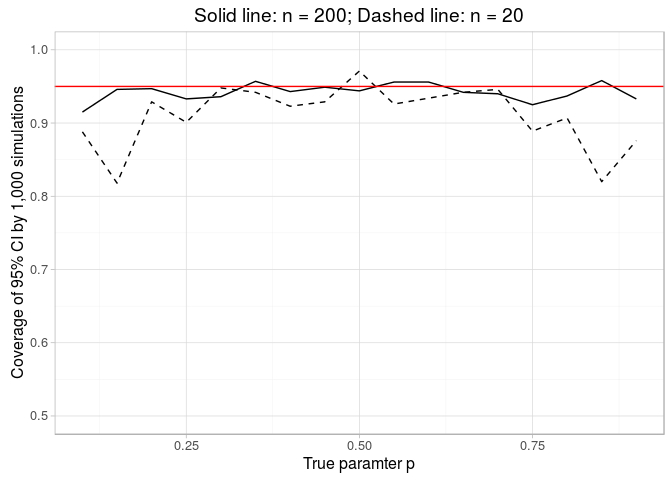

# Exercises  from Little Inference Book
Andrey Ziyatdinov  
`r Sys.Date()`  


# Include


```r
library(pander)
library(ggplot2)

library(tidyverse)
```

## Settings


```r
theme_set(theme_light())

panderOptions('table.style', 'rmarkdown')

panderOptions('table.split.table', Inf)
panderOptions('knitr.auto.asis', FALSE)
```

# Simulations

## The standard error of the mean

What is the variability of the mean of a sample, if we get only a single realization?
(Spoiler: $\sigma^2 / n$.)
[Simulation](https://leanpub.com/LittleInferenceBook/read#leanpub-auto-simulation-example-1-standard-normals)
with repeated sample avergaging can answer the question.

Before going to the code, a small recap:

* The sample variance, $S^2$, estimates the population variance, $\sigma^2$.
* The distribution of the sample variance is centered around $\sigma^2$.
* The variance of the sample mean is $\sigma^2 / n$.


```r
nsim <- 1000
n <- 10

set.seed(1)

sim_means <- 
  rep(n, nsim) %>%
  sapply(. %>% rnorm %>% mean)
  
sim_means_sd <- sim_means %>% sd
```


|          method          |   sd   |
|:------------------------:|:------:|
|   theory: 1 / sqrt(n)    | 0.3162 |
| simulation: sim_means_sd | 0.3233 |


```r
ggplot(data.frame(mean = sim_means), aes(mean)) + geom_histogram() + 
  geom_vline(xintercept = c(-sim_means_sd, sim_means_sd)) 
```

 
 
## Confidence interval for the mean

Some references:

* http://www.cyclismo.org/tutorial/R/confidence.html
* http://stackoverflow.com/questions/15180008/how-to-calculate-the-95-confidence-interval-for-the-slope-in-a-linear-regressio


We know that the sample mean is a radom variable.
[The Central Limit Theorem (CLT)](https://leanpub.com/LittleInferenceBook/read#leanpub-auto-the-central-limit-theorem) gives us an idea of its distribution for iid variabels with the increasing sample size.

The CLT says:

$\frac{\bar{X_n} - \mu}{\sigma / \sqrt{n}} = \frac{\mbox{Estimate} - \mbox{Mean of estimate}}{\mbox{Std. Err. of estimate}}$

aproaches to a standard normal distribution for large $n$. Note that replacing the standard error by its estimate doesn't change the theorem.

In short: CLT says that $\bar{X_n}$ is approximately $N(\mu, \sigma^2 / n)$.

### Confidence intervals of the mean

The formula: $\bar{X_n} \pm Z_{1 - \alpha / 2} \frac{\sigma}{\sqrt{n}}$.

For normal distribution:


```r
n <- 100
x <- rnorm(n)

alpha <- 0.05
(mean(x) + c(-1, 0, 1) * qnorm(alpha/2) * sd(x) / sqrt(n)) %>% round(2)
```

```
[1]  0.16  0.01 -0.15
```

For binomial distribution ($\mu = \hat{p}$ and $\sigma^2 = \hat{p} (1 - \hat{p})$): 


```r
n <- 100
k <- 56

p <- k / n

alpha <- 0.05
(p + c(-1, 0, 1) * qnorm(alpha/2) * sqrt(p * (1 - p)) / sqrt(n)) %>% round(2)
```

```
[1] 0.66 0.56 0.46
```

### Simulation of confidence intervals

One can **not** technicaly sat that the CI contains the parameter with probability, e.g. 95% 
(Bayesian credibal intervals address this point).

The CIs described an aggregate behavour: the CIs say the percetage of intervals 
that would include the estimated parameter when repeating the experiment many times.

Simple simulations for binomial data will illustate this notion:


```r
probs <- seq(0.1, 0.9, by = 0.05)

set.seed(1)

simulate_coverage_trial <- function(n, p, alpha = 0.05)
{
  x <-  rbinom(n, size = 1, prob = p)
  phat <- mean(x)
  
  d <- qnorm(1 - alpha / 2) * sqrt(phat * (1 - phat) / n)
  ll <- phat - d
  ul <- phat + d
  
  return(ll < p & ul > p)
}

simulate_coverage <- function(nsim, n, p, alpha = 0.05)
{
  num_cov_sum <- rep(n, nsim) %>%
    sapply(. %>% simulate_coverage_trial(p, alpha)) %>%
    sum
  
  num_cov_sum / nsim # avr among `nsim` repetitions 
}

sim_cov_n20 <- 
  probs %>%
  sapply(. %>% simulate_coverage(nsim = 1000, n = 20, .))

sim_cov_n200 <- 
  probs %>%
  sapply(. %>% simulate_coverage(nsim = 1000, n = 200, .))
```

 

The bad coverage for the case $n = 20$ demonstrates that 
the CLT applicability for CIs requires a large sample size.


## T-test

The t-statistics for one-sampe test:

$\frac{\bar{X_n}  - \mu_0}{S / \sqrt{n}}$


```r
data(father.son, package = "UsingR")
x <- with(father.son, sheight - fheight)
t.test(x)
```

```

	One Sample t-test

data:  x
t = 11.789, df = 1077, p-value < 2.2e-16
alternative hypothesis: true mean is not equal to 0
95 percent confidence interval:
 0.8310296 1.1629160
sample estimates:
mean of x 
0.9969728 
```

Condidence intervals:


```r
alpha <- 0.05
n <- length(x)
df <- n - 1

mean(x) + c(-1, 0, 1) * qt(1 - alpha/2, df) * sd(x) / sqrt(n)
```

```
[1] 0.8310296 0.9969728 1.1629160
```

Statistics:


```r
ts <- mean(x) / (sd(x) / sqrt(n))
# two-tailed test
2 * pt(ts, df, lower.tail = FALSE)
```

```
[1] 2.957226e-30
```


```r
data_frame(x = c(-15, -5, seq(-3, 3, by = 0.1), 5, 15)) %>%
  mutate(y = dt(x, df = df)) %>%
  ggplot(aes(x, y)) + 
    geom_line() + geom_vline(xintercept = ts, color = "red") +
    labs(title = paste("Standard t-distribution with df =", df))
```

 

